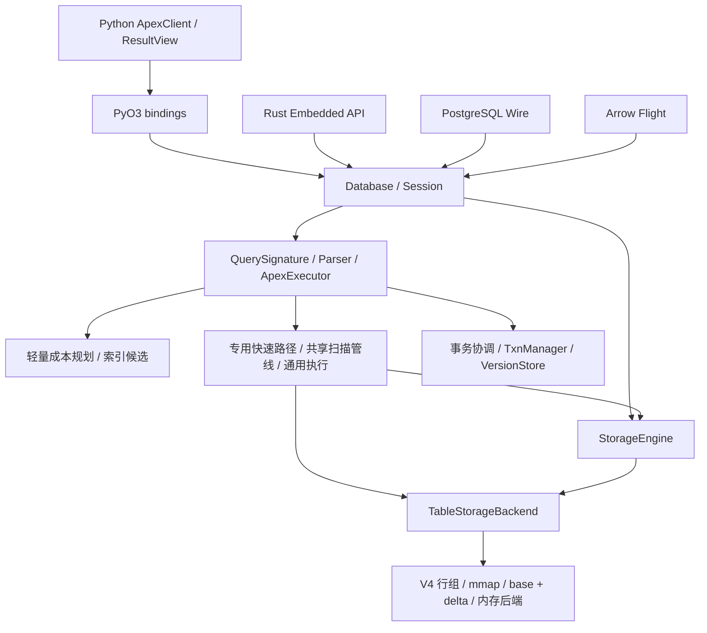

# ApexBase 架构评估与渐进式重构方案

> 评估日期：2026-09-06。代码快照：`d0f7d282502f9eeb948a20fc9fbeefce22a897cb`，版本 `1.33.1`。
> 本文为源码静态评估和实施建议，不代表重构已经实施，也不构成功能、性能或崩溃恢复验收。此次仅新增评估文档及导航，不修改运行时代码、测试、benchmark 或 AGENTS.md。

> 当前导航（2026-09-20）：下方 2026-09-10 状态说明保留为历史记录。主要实施项已推进至
> [剩余计划第 15 节](ARCHITECTURE_REFACTOR_REMAINING.md#15-剩余项收口2026-09-20)；
> 最新该批 full 135 项通过，canary 两轮原始 exit 1。证据持久化、文档同步与 V1 复核按
> [架构收尾计划](ARCHITECTURE_CLOSEOUT_2026_09.md)执行。登记延期或噪音例外不等于实现或门禁通过。

> 后续状态说明（2026-09-10）：第 1–9 节保留最初评审快照，第 10 节以后为历史实施记录。整体重构尚未完成；当前剩余目标、优先级和验收债务统一维护于[剩余工作与执行计划](ARCHITECTURE_REFACTOR_REMAINING.md)。R5.12 普通执行只读取校准，反馈写入仍仅发生在 EXPLAIN ANALYZE；其 canary 五样本终判未通过，专项 A/B 和完整模式通过不替代 canary 通过。C1（提交失败结果分类）已于 2026-09-10 完成实施与最终验收：canary（64 项）与 full（109+10+8+4+4 项）对 base `1b60ae8` 均 exit 0，报告见 `local-perf-results/c1-acceptance-20260910-214229/`；细节维护于[剩余工作与执行计划](ARCHITECTURE_REFACTOR_REMAINING.md)。

## 1. 总体判断

**建议保留现有 Rust 核心和 V4 存储，采用分阶段、可回滚的重构。第一优先级是事务提交的错误传播与一致性，其次是共享物理执行、状态归属和资源边界。当前没有足够证据支持推倒重写。**

ApexBase 已经形成有价值的技术基础：统一的 Database/Session 入口、列式行组存储、mmap 按需读取、base/delta 合并、Arrow 互操作、索引与统计、类型化扫描谓词，以及字典编码上的融合聚合。这些能力值得保留。

主要问题在于这些能力尚未完全围绕同一套执行和状态生命周期组织。快速路径、共享扫描和通用求值并存；事务管理器与存储提交分离；缓存由多个层级维护；大型源码文件承担过多决策。继续逐条增加 SQL 特例，可能使新查询组合更难预测、更难证明正确。

| 维度 | 当前判断 | 改进方向 |
| --- | --- | --- |
| 产品与技术路线 | 嵌入式、Rust 核心、Arrow 互操作的方向清楚 | 继续以单机可靠性和真实工作负载为中心 |
| 分层设计 | 已有统一入口和静态依赖约束，但入口统一不等于状态归属统一 | 收敛提交、缓存、会话与物理访问职责 |
| 存储设计 | V4 行组、delta、按需读取是有效基础 | 先强化一致性和读视图，暂不更换文件格式 |
| 查询执行 | 专用优化丰富，共享执行仍是局部纵向切片 | 逐步扩大可组合算子覆盖，保留低开销内核 |
| 事务与恢复 | 已有 OCC、版本存储和 WAL；提交错误处理存在明确缺口 | 优先建立可验证的提交协议与故障恢复行为 |
| 内存与并发 | 有按需存储和局部并行，未形成统一查询资源约束 | 分批执行、内存预算、取消和服务端背压 |
| 工程可维护性 | 有架构契约测试和严格性能门禁，但文件与文档仍需治理 | 按职责拆分，统一能力清单和验收记录 |

不对性能打主观分数，也不依据静态代码承诺相对 SQLite/DuckDB 的速度优势。

## 2. 当前真实架构

### 2.1 主要调用链



这是主要执行关系，省略目录、FTS、向量和缓存细节。执行器仍直接使用部分 backend 能力；图中的分支不能理解成所有查询必经完整规划器，也不能理解成所有读都已经通过共享扫描。

### 2.2 已经做对的部分

1. **上层入口收敛。** `database.rs` 的 `Session` 负责查询根目录、临时目录上下文的进入和恢复，Python、Embedded、Server、Flight 已有共同入口。静态测试禁止这些入口直接调用部分底层接口。
2. **存储不依赖 SQL 执行器。** `test_phase23_architecture_contracts.py` 明确约束 storage 内不得依赖 `crate::query` 或 `ApexExecutor`。这条依赖方向应继续保留。
3. **物理扫描协议已有类型边界。** `ScanValue` 保留 Int/UInt/Float/String/Bool，`ScanPredicateExpr` 支持 AND/OR，叶节点包含比较、区间、IN 和 NULL 判断；候选裁剪之后重新执行完整谓词。
4. **覆盖状态有正确性回退。** `TableStorageBackend::scan()` 检查 delta、pending delta 和内存行；存在覆盖层时走合并读取。对无法安全转换的宽整数与 UInt64，不强行使用旧的数值候选路径。
5. **已有真正减少中间结果的内核。** `on_demand/fused.rs` 直接遍历行组，在字典键与数值列上执行过滤聚合，支持借用视图和复用解码缓冲。这是通用执行演进可以吸收的经验。
6. **缓存失效已有共同基础。** `storage/epoch.rs` 维护表代际，`LogicalWrite` 合并嵌套写入的代际发布，并有跨客户端、事务提交、schema rewrite 的测试。
7. **已经约束真实性。** 同机 base/current 门禁保留交错样本、兼容性校验和回退确认；Python/Rust 路由共享语料已有一致性测试。

### 2.3 复杂度集中位置

以下为当前快照的物理行数，包含注释、空行及文件内测试，仅用于定位阅读与修改成本，不能直接等同于代码质量。

| 文件 | 行数 | 当前职责与风险 |
| --- | ---: | --- |
| `query/executor/select.rs` | 12,313 | SELECT 路由、候选判断、多种专用内核适配与通用回退集中 |
| `storage/backend.rs` | 6,896 | 存储访问、扫描适配、多种读写委托与缓存相关逻辑集中 |
| `query/executor/expressions.rs` | 6,881 | 表达式语义与大量函数实现集中 |
| `query/sql_parser.rs` | 6,877 | 语法、表达式解析及相关测试集中 |
| `python/apexbase/client.py` | 5,960 | 客户端状态、SQL 路由、结果转换、缓存和 API 集中 |
| `query/executor/joins.rs` | 4,560 | Join 与表解析相关能力集中 |
| `database.rs` | 583 | 已有薄 façade，适合继续作为稳定入口 |

拆文件本身不产生运行时收益。应按职责减少交叉依赖和重复决策，避免把一个大文件机械变成多个相互调用的小文件。

## 3. 关键发现与优先级

### A1 · P0：事务提交状态与持久化结果脱节

**已确认的代码事实：**

- `execute_commit_txn()` 首先调用 `TxnManager::commit_with_writes()`。
- 后者完成 OCC 校验后设置 `Committed`、移除活动事务，并将提交版本写入 VersionStore；之后才由执行器落到表存储。
- 执行器中多处 WAL 操作用 `let _ = ...` 忽略错误；打开 WAL backend 的失败也未向上返回。
- `apply_txn_writes()` 返回 `i64`，多处写入失败仅 `eprintln!` 后继续处理，外层最后可能返回已应用计数作为成功结果。
- UPDATE 在此处未逐条记录事务 WAL；后续索引保存则可能在数据已经应用后返回错误。

**影响判断：** 当前错误传播不能保证调用方区分完整成功与部分应用。多个表的 WAL 分别提交，单凭本路径也不能证明跨表崩溃原子性。这是可靠性优先事项，不能通过一次普通成功提交测试消除。

**尚未验证：** 故障发生时可见数据的具体组合、各 durability 模式的恢复覆盖、跨进程读到中间状态的条件。本次没有注入磁盘故障或运行 kill/reopen 测试，不能将所有风险描述为已经复现的数据损坏。

**建议：** 将校验、持久化、可见性发布和事务结束视为同一提交协议。先补真实故障复现，再设计最小的协调状态机。仅把日志改成 `?` 仍不足以撤销已经应用的写入；必须明确失败前后哪些状态允许重试、哪些状态需要恢复。跨表原子提交如需新增数据库级提交记录，应单独评审格式兼容与恢复协议，不能直接叠加未经验证的“两阶段”抽象。

### A2 · P1：共享扫描还不是分批物理流水线

`ScanRequest` 已存在，但 `scan()` 当前返回 `Option<Morsel>`，内部可能调用 `read_columns_to_arrow(..., 0, None)` 读取全部所需列。`try_scan_group_pipeline()` 随后调用 `into_record_batch()`，再交给 `execute_group_by()`。

这意味着共享协议目前主要统一选择语义，尚未普遍将内存占用约束为“一个批次加算子状态”。同时，融合聚合内核本身已经能按行组流式执行，不能把局部通用管线的限制概括为整个数据库都无法流式处理。

建议从单表 Filter → Aggregate → HAVING → TopK 扩展：先让读取端逐行组产生批次，聚合与 TopK 增量消费选择向量，再逐步延迟最终物化。对高基数 GROUP BY、全排序、Join 仍需单独的状态预算，分批扫描不会自动解决这些问题。

### A3 · P1：语义适配与物理选路仍然重复

Python 有 `_classify_sql_route()`，Rust 有 `QuerySignature`；共享路由语料能约束 route family，但详细快速路径仍需两侧维护。执行器中还同时存在 SQL AST 到 `ScanPredicateExpr` 和到 `FusedPredicate` 的适配。

SELECT 的一条 CBO 路径用 `QueryPlan.strategy` 判断是否跳过索引，然后再调用 `try_index_accelerated_read()` 提取执行条件。这表明规划信息在该路径中主要充当选择开关，尚非所有物理执行的唯一输入。

建议复用已存在的 `QueryPlan`/`ExecutionStrategy`，逐条使索引候选携带可直接执行的键、范围、残余谓词和物化信息；不要另起一套竞争的计划系统。SQL 语义由公共类型化层确定，融合内核保留紧凑的物理表示，在扫描之前完成 lowering，避免逐行动态分发。

Python 的纯客户端快捷操作可以保留。通过基准确定哪些分类值得移到已有 FFI 调用中，不为“统一分类”增加额外一次热路径 FFI。

### A4 · P1：缓存和会话生命周期分散

当前存在执行器的 `STORAGE_CACHE`、StorageEngine 的 backend 缓存、绑定层的 `cached_backends`、Python 查询结果缓存，以及索引、字典、统计、协议 schema 等缓存。`Database::cached_backend()` 仍委托执行器缓存，说明 façade 已统一调用入口，资源归属尚未统一。

`Session` 当前借用路径，通过 RAII 恢复线程局部上下文；执行器还有 `SESSION_VARS` 等 TLS 状态。调度器任务只携带 SQL 和 table path，Flight 则通过 `spawn_blocking` 执行。因此，会话跨线程传播需要专门验证，不能仅根据存在 `Session` 类型就推断所有入口的事务和临时对象语义完全一致。

建议先建立状态清单：owner、key、数据来源、容量、失效时机、关闭时机、跨进程行为。之后逐项明确唯一权威 owner，允许绑定层继续保留带代际校验的低开销引用缓存。不要把所有缓存简单合并成一把全局锁，也不要删除仍被引用的 mmap 所有者。

### A5 · P1/P2：按需存储与查询内存上限尚未打通

存储已有按需读取与增量落盘，但在本次检查的通用扫描、调度器和协议路径中，没有看到统一的查询内存预算、取消检查和准入控制贯穿执行。

`scheduler.rs` 是整条查询的线程池，队列采用 `VecDeque`；它不是 morsel 调度器。Flight 将查询先转成完整 RecordBatch，再用单元素流编码；传输接口是流不代表执行过程具有背压。`get_flight_info()` 也会执行查询取得 schema，需要评估之后 `do_get()` 再执行的成本与一致性。

建议先串行分批，明确内存所有权，再考虑并行。将执行预算与取消信息随查询上下文传递；服务端限制排队和并发，将取消传播到执行器；元数据请求优先走安全的 schema 推导。暂不让嵌入式点查询为服务端队列和遥测支付固定锁成本。

### A6 · P1：设计文档存在状态漂移

| 文档内容 | 当前证据 | 处理建议 |
| --- | --- | --- |
| 扫描文档仍描述合取列表和较早的谓词类型 | `scan.rs` 已有类型化 AND/OR/IN/NULL 谓词 | 后续同步能力表、限制及 fallback 条件 |
| 优化器路线图把复合 key、generation 等列为缺口 | 同一文档后续已勾选完成；源码已有相关结构 | 按源码、行为测试、验收证据重新标注状态 |
| Engineering Guidelines 禁止新增结果缓存 | Python 当前已有结果缓存及禁用/失效测试 | 明确现有行为与后续规则，不能仅据旧文档删除功能 |
| 旧路线图给 pytest 设 9 秒限制 | 当前 AGENTS.md 明确不设硬时间限制 | 后续普通文档对齐 AGENTS.md；不得修改 AGENTS.md |

本文记录这些矛盾，不把旧路线图中的勾选视为当前验收通过。本次不批量重写历史记录。

## 4. 目标设计

目标是收敛职责和数据流，不是增加一个庞大的框架。下面的名称表示职责，是否新增类型由实施阶段决定。

```text
Python / Embedded / PG / Flight
             │ 适配输入与输出，不持有独立 SQL 执行语义
      Database + Session
             │ 显式查询上下文与生命周期
     QuerySignature / Parser
             │ 快捷路由可直接选已有内核
      可执行的 QueryPlan
             │ 类型化谓词、访问路径、残余表达式
      物理算子与融合内核
             │ 分批输入 + selection + 增量状态
      存储读视图 / Scan
             │ base、delta、内存后端的统一可见性契约
      V4 / 索引 / 字典 / 编码

写入：事务校验 → 持久化协议 → 可见性及代际发布 → 完成
支撑：有明确归属的缓存、内存预算、取消、可选执行统计
```

关键契约：

- 物理内核可以多种实现，但类型、NULL、精确整数、残余谓词和结果排序语义必须一致。
- 候选裁剪只能保守缩小扫描范围；不支持的语义必须回退，不能近似处理后声称精确。
- 聚合消费选择向量；只在算子确需连续数组或返回边界进行 gather/物化。
- base 与 delta 的批次读取必须共享一致读视图，防止分批过程中重复、漏读和新旧 schema 混合。
- mmap/Arrow 借用数据的生命周期必须覆盖所有输出消费者，包括延迟 ResultView 和关闭客户端后的合法结果访问。
- 代际发布与成功逻辑写入协调；缓存失效不能代替事务可见性或恢复协议。
- 快速路径关闭诊断后不增加逐行分支、锁、I/O 或新的 FFI。
- 先使用静态调用、现有 enum 和借用；只有第二个真实消费者出现时才提取新公共抽象。

## 5. 分阶段执行计划

所有阶段均为建议，尚未开始实现。按独立变更批次推进，不承诺未经实测的工期或加速比例。每一阶段的完成标准同时包含本节目标和第 7 节验收。

| 阶段 | 工作与交付物 | 依赖 | 完成标准 | 回滚方式 |
| --- | --- | --- | --- | --- |
| R0：事实与基线 | 更新能力清单；固定 Git base、环境、查询语料、结果缓存设置；记录关键路径的现有耗时与内存 | 无 | 有可复现原始报告；实现/测试/性能证据分开列示 | 仅文档与诊断记录可独立撤回 |
| R1：提交正确性 | 复现 WAL/数据/索引失败；明确提交状态、错误传播、恢复及跨表语义；实现最小修复 | R0 | 不再把部分写入当成功；失败和重启行为符合明确契约；Rust/Python 覆盖 | 无格式变更优先；格式变更独立评审，禁止盲目旧二进制回退 |
| R2：职责拆分 | SELECT 按路由、索引访问、聚合 lowering、扫描适配、TopK 拆分；逐步清理 backend 委托职责 | R1 | 路由顺序、API、错误语义不变，交叉依赖减少；不出现新的重复实现 | 纯移动与行为变更分开提交 |
| R3：串行分批执行 | 扩展现有 scan 协议与稳定读视图；先覆盖 Filter/Aggregate/HAVING/TopK；融合内核继续可选 | R0、R1、R2 | 多批与单批结果一致；固定分组规模下扫描内存不随全表行数线性增长；目标性能有同机证据 | 内部选路保留旧实现，确认回退后关闭新路径 |
| R4：资源与状态归属 | 梳理 cache owner；显式传播会话上下文；预算、取消、协议背压及分批结果桥接 | 状态清单可在 R2 开始，流式交付依赖 R3 | close/reopen、跨客户端、跨进程与取消语义可验；缓存和队列可受控 | 每种缓存和每个入口单独迁移 |
| R5：规划与并行 | 让已有 QueryPlan 直接驱动物理访问；记录实际路径；按工作负载校准成本；最后评估 morsel 并行 | R3、R4 | EXPLAIN 与实际执行一致；简单查询无回退；并行有明确收益且无资源超订阅 | 保留固定/串行策略，收益不足不默认启用 |
| R6：按需求扩展 | 高基数聚合/排序/Join 的外部执行、FTS/向量组合计划、独立构建 feature | 真实 workload 与容量证据 | 每项有独立设计、兼容性与收益验收 | 未达到收益门槛不进入默认路径 |

R2 拆分中应优先复用已有 `aggregation/`、`dml/`、`mmap_scan/` 组织形式。不要同时拆 crate、换 parser、改格式和替换执行器。

### 第一批可落地任务：提交失败契约

1. 沿 `execute_commit_txn()`、`commit_with_writes()`、WAL recovery 和索引保存补齐时序图，分别描述单表/跨表、内存/磁盘、Fast/Safe/Max。
2. 构建真实临时数据库，通过受控 I/O 故障或子进程中断复现提交中途失败。故障钩子只能触发失败，不能 mock 掉实际写入与恢复路径。
3. 断言返回状态、活动事务、VersionStore、磁盘数据、索引、epoch 和重开结果，明确是否允许重试及如何避免重复应用。
4. 在故障契约明确后完成最小修复。优先不变更公开 API 与文件格式；必要变更单独提出设计，不能仅重新排列几行调用就宣布原子性成立。
5. 所有文件修改完成后统一运行完整功能与性能验收，保留失败样本和原始报告。

此批不顺手扩展 SQL 语法，也不修改扫描算法，便于定位正确性与性能变化。

## 6. 测试与测量覆盖建议

现有测试已经覆盖事务普通提交/回滚、重开、跨表操作、cache invalidation、宽整数扫描和 Boolean 聚合，实施时应扩展这些语义，避免重复建立一套只验证新函数的测试。

| 改动领域 | 必须验证的边界 | 应增加的性能场景 |
| --- | --- | --- |
| 提交与恢复 | WAL begin/DML/commit 失败；数据应用/索引保存失败；中途退出与重开；重试幂等；跨表与各 durability | 单行事务、批量提交、更新比例、跨表提交、delta 积累后的读写 |
| 分批扫描 | 空表、批次边界、NULL、UInt64、超过 2^53 的整数、NaN、未支持类型回退、删除/更新覆盖、并发写入读视图 | 选择率阶梯、投影宽度、行组数量、base-only 与 overlay、冷热文件缓存 |
| 聚合与 TopK | COUNT(*)/COUNT(col)、空组、高基数、HAVING 隐藏列、并列键、LIMIT/OFFSET、浮点归并误差、窗口回退 | 低/高基数、倾斜分布、小/大 K、Boolean/IN/range 的不同组合 |
| 缓存与生命周期 | 双客户端/双进程写入、DDL、drop/recreate、close/reopen、内存库隔离、结果持有期间关闭后端 | 点查缓存命中、失效频率、活跃表数量和缓存总内存 |
| 协议和调度 | 会话切换、临时表、事务跨请求、取消、慢消费者、队列饱和、线程切换 | 首批延迟、总延迟、并发吞吐、峰值 RSS、取消回收时间 |
| 物理计划 | 计划选路等于实际选路；索引残余条件完整；OR Union/AND Intersection/复合索引顺序一致 | 规划耗时、索引与扫描交叉点、物化成本、4–8 表真实 Join |

测量要求：

- 计算性能显式使用 `enable_cache=False`，记录设置；结果缓存收益另行测量。解析缓存、字典缓存、OS 页缓存不是查询结果缓存，需分别标明冷热条件。
- 分离读取、谓词、gather、聚合、排序、输出转换的成本；诊断关闭时不承担完整采样开销。
- 单独记录峰值 RSS、扫描/解码字节、物化行数和首批延迟。完整结果 API 本身可能需要 O(输出大小) 内存，不把它误判为扫描批次预算失败。
- 复杂查询性能断崖目前是结构性风险，必须用同一语义的小幅 SQL 变体和数据分布变化去证实，不能直接给出倍数。
- 性能收益的完成标准应绑定实际瓶颈。例如低基数组合查询验证分批内存曲线；点查验证延迟无回退；Join 先证明中间结果是瓶颈，再添加算法。

## 7. 实施验收与兼容性

后续代码修改以仓库 [AGENTS.md](https://github.com/BirchKwok/apexbase/blob/d0f7d282502f9eeb948a20fc9fbeefce22a897cb/AGENTS.md) 为强制约束，不能用本文替代或放宽。采用 conda base，所有最终文件修改完成后按顺序执行：

```bash
maturin develop --release
pytest
cargo test
python benchmarks/bench_vs_sqlite_duckdb.py
python benchmarks/run_local_perf_guard.py --base-ref origin/main
```

核心查询/存储热路径、架构阶段最终验收、发布前及其他 AGENTS.md 指定情形，追加：

```bash
python benchmarks/run_local_perf_guard.py --base-ref origin/main --mode full
```

- 普通门禁：200,000 行、2 次预热、7 次计时；完整模式：1,000,000 行、2 次预热、5 次计时。构建后默认至少等待 30 秒。
- 初始按 B-C-C-B-B-C 每侧三个样本；发现回退必须追加每侧两个样本，以五样本中位数判断。保留所有不利样本。
- 两侧同机、相同 Python/环境/依赖、release 构建且 Cargo 产物隔离；current 包含工作区有效修改。
- 不调大默认 15% 相对阈值与 0.005 ms 绝对阈值；两者同时超限判回退。退出码非 0 不得声称通过。
- 公开 benchmark 与仓库最新公开基线比较。本次确认 `benchmarks/latest_public_baseline.json` 存在，其配置为 1,000,000 行、2 次预热、5 次计时、`apex_result_cache=false`；这只是基线文件检查，不是重新运行 benchmark。实施时再次核实最新文件，不能以历史公开数值替代同机比较；若届时基线不存在，按 AGENTS.md 保存初始基线。
- “78 项”是 AGENTS.md 的验收称谓；实际指标集合随仓库扩展，以当前脚本和报告为准，不能裁剪到旧数量。报告应列出实际指标数和缺失检查。
- 报告保存在 `local-perf-results/<timestamp>/` 或明确指定目录，记录实际 base SHA，防止 `origin/main` 漂移导致阶段间对比不清。
- pytest 完整串行执行；记录 release 重装后首次冷态耗时，不设硬时间限制。完整 cargo 单元与文档测试均需通过。
- 每次原子修改检查范围、依赖方向、额外分配/锁/I/O、新增语义覆盖和回滚方式；完整性能测试集中到最终执行。

兼容性原则：保留 Python/Rust 公共 API、默认缓存行为、结果类型、SQL 错误语义和文件读取兼容性。内部流式接口先适配现有返回类型；公开流式 API、事务保证变化、文件格式变化应单独设计。数据格式迁移必须有版本检查、失败恢复和回退边界。

## 8. 暂缓的方案

- **整体重写执行器或存储引擎：** 当前没有全链路证据证明重写收益足以覆盖语义、性能和格式迁移风险。
- **直接接入另一套通用优化器：** 先让已有 QueryPlan 与执行器一致；若后续 SQL 复杂度确实需要外部组件，再按现有优化器路线图做独立原型评估。
- **先拆成多 crate 或服务化：** 文件和职责问题可以先在现有 crate 内解决，不能靠包边界掩盖循环依赖。Cargo 已有 Python/server/flight feature，但 JIT 等仍需具体成本测量后再决定可选化。
- **先做分布式：** `scaling/` 中存在节点、分片、路由结构，不等于已经有完整分布式执行与一致性协议；本次不据模块名称推断产品能力。
- **无预算地全面并行化：** 先完成读视图、分批执行、取消与内存边界，再测线程数和归并成本，避免与现有 Rayon、查询线程池、Tokio 阻塞任务竞争。
- **继续堆叠特定 SQL 文本优化：** 新优化优先落在公共扫描、编码或算子内核，通过真实数据分布和语义变体证明复用价值。

## 9. 源码证据索引

源码链接固定到本次评估的 Git 提交，避免后续主分支变更导致证据漂移。定位以函数/类型名称为准。

| 证据 | 定位与用途 |
| --- | --- |
| [Database/Session](https://github.com/BirchKwok/apexbase/blob/d0f7d282502f9eeb948a20fc9fbeefce22a897cb/apexbase/src/database.rs) | `Session::enter`、`QueryScope::drop`、`Database::cached_backend`：入口与缓存归属 |
| [存储引擎](https://github.com/BirchKwok/apexbase/blob/d0f7d282502f9eeb948a20fc9fbeefce22a897cb/apexbase/src/storage/engine.rs) | `get_read_backend`、`invalidate`：缓存与只读边界 |
| [扫描协议](https://github.com/BirchKwok/apexbase/blob/d0f7d282502f9eeb948a20fc9fbeefce22a897cb/apexbase/src/storage/scan.rs) | `ScanValue`、`ScanPredicateExpr`、`Morsel`：精确类型与批次协议 |
| [Backend](https://github.com/BirchKwok/apexbase/blob/d0f7d282502f9eeb948a20fc9fbeefce22a897cb/apexbase/src/storage/backend.rs) | `scan`、`scan_candidate_indices`：overlay 判断、候选与完整谓词 |
| [SELECT](https://github.com/BirchKwok/apexbase/blob/d0f7d282502f9eeb948a20fc9fbeefce22a897cb/apexbase/src/query/executor/select.rs) | `try_scan_group_pipeline`、`cbo_skip_index`：物化与物理选路 |
| [融合内核](https://github.com/BirchKwok/apexbase/blob/d0f7d282502f9eeb948a20fc9fbeefce22a897cb/apexbase/src/storage/on_demand/fused.rs) | `FusedPredicate`、`FusedLaneView`：紧凑内核及行组处理 |
| [规划器](https://github.com/BirchKwok/apexbase/blob/d0f7d282502f9eeb948a20fc9fbeefce22a897cb/apexbase/src/query/planner.rs) | `QueryPlan`、`PlannerContext`、`plan_select_details`：现有规划能力 |
| [事务协调](https://github.com/BirchKwok/apexbase/blob/d0f7d282502f9eeb948a20fc9fbeefce22a897cb/apexbase/src/query/executor/dml/coordination.rs) | `execute_commit_txn`、`apply_txn_writes`：提交顺序与错误处理 |
| [事务管理器](https://github.com/BirchKwok/apexbase/blob/d0f7d282502f9eeb948a20fc9fbeefce22a897cb/apexbase/src/txn/manager.rs) | `commit_with_writes`：OCC、提交状态和版本发布 |
| [存储恢复](https://github.com/BirchKwok/apexbase/blob/d0f7d282502f9eeb948a20fc9fbeefce22a897cb/apexbase/src/storage/on_demand/storage_core.rs) | WAL recovery、提交事务筛选、增量数据：恢复审计入口 |
| [代际管理](https://github.com/BirchKwok/apexbase/blob/d0f7d282502f9eeb948a20fc9fbeefce22a897cb/apexbase/src/storage/epoch.rs) | `SharedEpoch`、`LogicalWrite`：表版本与发布 |
| [执行器状态](https://github.com/BirchKwok/apexbase/blob/d0f7d282502f9eeb948a20fc9fbeefce22a897cb/apexbase/src/query/executor/mod.rs) | `STORAGE_CACHE`、`SESSION_VARS`、表写锁与索引缓存 |
| [Python 客户端](https://github.com/BirchKwok/apexbase/blob/d0f7d282502f9eeb948a20fc9fbeefce22a897cb/apexbase/python/apexbase/client.py) | `_classify_sql_route`、`_execute_impl`、`_query_result_cache` |
| [查询调度器](https://github.com/BirchKwok/apexbase/blob/d0f7d282502f9eeb948a20fc9fbeefce22a897cb/apexbase/src/query/scheduler.rs) | `QueryTask`、`submit`、`execute_query`：队列与上下文 |
| [Flight](https://github.com/BirchKwok/apexbase/blob/d0f7d282502f9eeb948a20fc9fbeefce22a897cb/apexbase/src/flight/service.rs) / [PG](https://github.com/BirchKwok/apexbase/blob/d0f7d282502f9eeb948a20fc9fbeefce22a897cb/apexbase/src/server/handler.rs) | 完整结果转换、schema 获取与 Session 入口 |
| [分层契约](https://github.com/BirchKwok/apexbase/blob/d0f7d282502f9eeb948a20fc9fbeefce22a897cb/test/test_phase23_architecture_contracts.py) / [路由契约](https://github.com/BirchKwok/apexbase/blob/d0f7d282502f9eeb948a20fc9fbeefce22a897cb/test/test_query_architecture_contracts.py) | 静态边界、共同语料、Boolean/宽整数与 fallback 测试 |
| [缓存契约](https://github.com/BirchKwok/apexbase/blob/d0f7d282502f9eeb948a20fc9fbeefce22a897cb/test/test_cache_invalidation_contract.py) / [事务测试](https://github.com/BirchKwok/apexbase/blob/d0f7d282502f9eeb948a20fc9fbeefce22a897cb/test/test_transactions.py) | 当前正常路径与失效语义的覆盖基础 |
| [门禁脚本](https://github.com/BirchKwok/apexbase/blob/d0f7d282502f9eeb948a20fc9fbeefce22a897cb/benchmarks/run_local_perf_guard.py) | `SAMPLE_ORDER`、`benchmark_arguments`、工作区快照与完整模式 |

相关设计：[存储架构](STORAGE_ARCHITECTURE.md)、[扫描架构](SCAN_EXECUTION_ARCHITECTURE.md)、[优化器路线](QUERY_OPTIMIZER_ROADMAP.md)、[工程约束](ENGINEERING_GUIDELINES.md)、[HTAP 路线](HTAP_ROADMAP.md)。本文是该快照的评估与建议；后续实施应更新阶段状态并附功能、故障恢复和同机性能证据。
## 10. 实施状态（R1：提交正确性）

状态：已完成，验收证据见下。本阶段未变更公开 API 与文件格式；改动已提交为 `origin/main`（d0f7d28）之上的 3 个 commit（`dc691d5`、`323220f`，另加本文档 `45663d4`）。

### 10.1 提交契约与实现

- **两阶段提交**：`TxnManager::prepare_commit`（OCC 校验 + 预留写意图）→ 协调层执行 WAL begin/DML/commit marker → `finalize_commit`（发布 committed_writes、VersionStore、水位与快照释放）。WAL commit marker 是提交点：其前失败回滚并传播错误；其后失败则事务已在 WAL 中持久提交，错误仍向调用方传播，行在下次 open 恢复收敛，调用方不得重试 DML。部分写入不再被当作成功返回。
- **崩溃恢复**：safe/max 表 open 时按 WAL 水位 sidecar（`<table>.apex.wal.meta`，8 字节已应用长度）门控，稳态 open 仅 stat + 8 字节读。恢复时截断 torn 尾批、重建缺失的已提交 insert、重放已提交 delete，并以 `is_live_txn` 跳过本进程在途提交，避免重复应用。
- **错误传播**：COMMIT 失败时 Rust 侧清除 `current_txn_id`、Python 侧清除 `_in_txn` 并抛出原始错误，两层客户端状态不再残留。
- **附带修复（R1 验收中发现）**：`try_dict_indexed_read` 的 `_id` 投影曾返回 0 基文件偏移而非真实行 ID（行 ID 自 1 起），`SELECT _id ... WHERE string_col = 'v'` 结果错位；改为经 `read_ids_by_indices` 读取真实 ID，canary 新增指标 "Projected _id string equality" 覆盖该路径。
- **附带修复（canary 回退定位）**：恢复引入的 `delta_complete_batches` 双遍扫描使每次 delta 读多走一遍文件，canary 初判 2 项聚合指标回退；按既有 `DELTA_ROW_COUNT_CACHE` 模式加 (len, modified) 键的批次边界缓存（`DELTA_BATCH_CACHE`，128 上限，delta 重写/删除时失效），稳态 delta 读恢复单遍成本，复测 canary 通过且相关指标改善。

### 10.2 验收证据（conda base，release 构建，同机 M1 Pro 10 核）

| 项目 | 结果 |
| --- | --- |
| 完整串行 pytest | 1746 passed |
| 完整 cargo test --release | 517 单元 + 6 文档测试 passed |
| 公开 benchmark（1M 行，2 预热 5 计时） | 72 项表格 + 6 项向量全部执行；向量 6/6、量化 6/6 胜出；报告 `benchmarks/results/r1_public_20260907.json` |
| 本地同机 canary（base=origin/main，200K 行） | 通过，55 指标，报告 `local-perf-results/20260907-005334/` |
| 本地同机完整模式（1M 行，109 项 + Q/s + 量化） | 通过，报告 `local-perf-results/20260907-030635/` |

完整模式说明：首次完整运行（`local-perf-results/20260907-010903/`）在 5 样本中位数判定中仅 INTERSECT (ordered) 一项 +26.69%（其余指标含 Q/s、量化均通过）。对该指标做了 40 次/侧、逐窗口交错的聚焦 A/B：base 中位数 0.896 ms vs current 0.811 ms（current 更快，分布更窄），判定为首轮采样窗口的测量噪声；重跑完整门禁（`20260907-030635/`）109 项全部通过，此前波动指标（INTERSECT/UNION/COUNT(*)/ORDER BY LENGTH）均落在 ±4% 内。两轮的原始样本全部保留。

环境说明：验收期间机器后台负载约 5（含浏览器进程），亚毫秒级指标的跨运行波动明显（不同运行标记的指标集合不一致）；回退判定以同机 base/current 门禁与聚焦 A/B 为准，公开基线（`benchmarks/latest_public_baseline.json`，492956bb）仅用于趋势与执行完整性，未据此放宽任何结论。

新增测试：`on_demand/tests.rs` +8（7 个恢复用例 + 1 个 delta 批次缓存失效用例）、`backend.rs` +1（`_id` 投影回归）、`test_commit_crash_recovery.py`（kill -9 全有全无与失败提交收敛，5 用例）、`test_transactions.py` +1（冲突提交后客户端状态清除）、`test_query_architecture_contracts.py` +1（`_id` 投影回归）。

### 10.3 残余风险（进入后续阶段前记录）

1. 恢复重建的行位于 delta 层，索引快路径有 `!has_delta()` 守卫不会漏读；delta 被 compact 进 base 时的索引重建路径未专门测试。
2. UPDATE 无逐条 WAL 记录（现有格式），恢复只保证 insert/delete 的 WAL 收敛；UPDATE 的崩溃窗口语义仍是尽力而为。格式变更需独立评审。
3. 跨表原子提交记录尚未引入（各表 WAL 独立记录），跨表 commit 的恢复粒度为按表收敛。
4. `open_txn_wal_backend` 固定 Safe 级别：Max 表的 commit marker 不 fsync（既有行为，本阶段未变更）。
5. 公开 benchmark 的跨日对比在亚毫秒指标上波动大，不宜单独作为回退证据。

## 11. 实施状态（R2：职责拆分）

状态：已完成（9 个纯移动 commit），阶段最终验收通过。本阶段零行为变更：路由顺序、公开 API、错误语义不变，无新增重复实现；每个 commit 只移动代码，不修改任何函数体。

### 11.1 拆分明细

新文件均为 split impl block 形式：顶层 `impl ApexExecutor { ... }`，经 `query/executor/mod.rs` 的 `include!` 文本纳入同一模块（与既有 `select.rs`/`joins.rs`/`window.rs` 及 `dml/` 子模块的组织形式一致），因此无需任何可见性调整，跨文件方法调用（ddl/joins/topk 等）保持原样。

| 新文件 | 职责 | 行数 |
| --- | --- | --- |
| `index_access.rs` | 索引加速读取：`try_index_accelerated_read`、谓词提取（`extract_index_predicates` / `is_fully_indexable_predicate` / `lookup_index_expression`）、index-only scan、行 ID 交并、`table_has_index_catalog` | 699 |
| `topk.rs` | ORDER BY+LIMIT top-k：数值过滤、NOT NULL、通用排序索引、批次补全 | 369 |
| `fused_group.rs` | 融合 GROUP BY：谓词树解析（`extract_fused_predicate`）、聚合 lane、精确/epsilon 边界 | 787 |
| `scan_pipeline.rs` | 扫描谓词 GROUP BY 族：filter+group+order、`build_scan_predicate`、cached transform/ratio/numeric、v4 | 1396 |
| `late_materialization.rs` | 扫描适配：SELECT * / ORDER BY / GROUP BY 的 late materialization | 825 |
| `fts.rs` | FTS：MATCH()/FUZZY_MATCH() 压缩 bitmap 解析与 score 投影 | 262 |
| `topk_vector.rs` | 向量 top-k：`topk_distance` 模式检测与距离计算 | 400 |
| `file_fast_paths.rs` | 外部文件快路径：CSV/JSON/Parquet count/聚合与文件读取器过滤下推 | 832 |
| `predicate_extract.rs` | 谓词提取助手：LIKE/IN/BETWEEN/比较/区间模式 | 334 |

`select.rs` 从 12313 行降至 6440 行，保留分发器 `execute_select_with_base_dir`（按计划路由最后拆）及 count/distinct、字符串/数值过滤、mmap 扫描快路径族。

对应 commit（`origin/main` d0f7d28 之上）：`80162ed` index_access、`eb7f20c` topk、`9e05399` fused_group、`1f1598b` scan_pipeline、`499baea` late_materialization、`f5b8628` fts、`d8bdf10` topk_vector、`c1e202d` file_fast_paths、`7da4db2` predicate_extract。

### 11.2 纯移动纪律与编译警告

- 每个 commit 的移动内容与移动前文件逐行一致（脚本核验：新文件无非包装行不属于原 `select.rs`；`select.rs` 除被移动块与其分隔空行外零增删），函数签名、doc 注释、逻辑均未改动。
- `include!` 为同模块文本纳入，未引入新的模块边界或 `pub(in ...)` 可见性变化；`dml/`、`aggregation/` 等既有子模块不受影响。
- 最终完整门禁的独立 release 构建为 197（基线）→ 201 条 warning：新增的 4 条报告记录来自同 5 个既有死函数（`try_fast_v4_group_by`、`try_fast_simple_agg`、`extract_bool_equality`、`try_fast_filter_groupby`、`execute_with_groupby_late_materialization`）由 rustc 在原文件中的 1 条“多函数未使用”警告，拆分后按 5 个文件分别报告；死代码集合与基线完全一致，未新增死代码。按 AGENTS.md，既有 warning 不在本阶段顺手治理。

### 11.3 验收证据（conda base，release 构建，同机 M1 Pro 10 核）

| 项目 | 结果 |
| --- | --- |
| 分批功能验证（9 批，逐批） | 每批：cargo check + 完整 cargo test --release（517 单元 + 6 文档）+ 完整串行 pytest（1746 passed），全部通过 |
| 完整串行 pytest（release 重装后冷态首跑） | 1746 passed in 21.88s |
| 完整 cargo test --release | 517 单元 + 6 文档 passed |
| 公开 benchmark（1M 行，2 预热 5 计时） | 103/103 项执行 + 向量 6/6 胜出；报告 `benchmarks/results/r2_public_20260907.json` |
| 本地同机 canary（base=origin/main，200K 行） | 通过，55 指标，报告 `local-perf-results/20260907-085433/` |
| 本地同机完整模式首轮（base=`d0f7d28`，1M 行） | 初判 2 项回退 → 五样本终判 1 项回退（Filtered aggregation (city) +23.89%）；聚焦 A/B 判定为采样噪声，见下；报告 `local-perf-results/20260907-090753/` |
| 本地同机完整模式复核（base=`d0f7d28`，同参数） | 一轮因 IN subquery COUNT 的窗口尖峰退出 1，原始报告与聚焦 A/B 全部保留；报告 `local-perf-results/20260907-122834/` |
| 本地同机完整模式最终重跑（base=`d0f7d28`，同参数） | 通过；初判 2 项回退后自动扩展，五样本终判 109/109 通过，Q/s 2/2、量化向量 8/8 通过；报告 `local-perf-results/20260907-140211/` |

公开 benchmark 与基线（`latest_public_baseline.json`，492956bb）对比：15 个工作负载组中 12 组持平或改善（-15.9% ~ -0.6%）；Aggregation +6.6%、Set Operations +13.3%、Subqueries & CTE +58.9% 为亚毫秒级负载（绝对 3.5 → 5.6 ms）的跨运行波动，该两项 ApexBase 仍 4/0 快于 SQLite/DuckDB。回退判定以同机 base/current 门禁为准。

完整模式首轮（`local-perf-results/20260907-090753/`）说明：五样本中位数下仅 `Filtered aggregation (city)` 0.448 → 0.555 ms（+23.89%，相对与绝对阈值同时超限）判为回退；原始样本显示 current 侧 5 个样本中 2 个为 3~5 倍孤立尖峰（1.606 / 1.981 ms），而 base 侧无同级尖峰，相邻同构指标 `Filtered aggregation (category)` 在 current 侧反而更快（0.428~0.454 ms）。随后对该指标做 40 次/侧、逐窗口交错（base10→current10×4 窗口）的聚焦 A/B（同一 1M 行数据集，两侧均 warm）：base 中位数 0.3125 ms vs current 0.3000 ms（**-4.01%，current 更快**），p10/p90 几乎重合（0.237/0.436 vs 0.239/0.430），且两侧均出现同级孤立尖峰（base 0.527/0.513，current 0.888/0.606）。判定为首轮采样窗口的测量噪声，与 R1 首轮 INTERSECT (ordered) +26.69% 的处理路径一致；未删除任何样本、未调整阈值，原始报告全部保留。

固定基线复核（`local-perf-results/20260907-122834/`）中，五样本终判仅 `IN subquery COUNT` 为 0.663 → 1.569 ms（+136.50%），current 五个样本为 0.763/2.022/1.569/0.680/4.631 ms，3 个尖峰推高了中位数；对应 base 为 0.632/0.865/0.632/0.663/0.697 ms。使用同一 1M 行数据库、相同 SQL 和两侧 release wheel 做 40 次/侧、4 个 base10→current10 窗口的聚焦 A/B，base 中位数 0.4167 ms、current 0.4279 ms（+2.69%），两侧均有窗口漂移且 current 有 1.04/2.14 ms 孤立尖峰；报告保存在 `local-perf-results/20260907-122834/focused-in-subquery/`。该失败不被覆盖或删除，阶段完成依据是随后从头执行、退出码为 0 的完整门禁（`local-perf-results/20260907-140211/`），其五样本终判 109 项全部通过。

### 11.4 残余与后续

1. 路由分发仍保留 count/distinct、字符串/数值过滤、mmap 扫描快路径族的派发；R3 扩展扫描协议后，该族可沿新协议边界继续拆分。
2. `topk.rs`（标量 top-k）与 `topk_vector.rs`（向量 top-k）按执行形态分列；若 R6 引入向量组合计划再统一重组。
3. 本阶段未触碰 `mmap_scan/`、`aggregation/`、`dml/` 内部结构，也未修改 backend 委托接口；"逐步清理 backend 委托职责"在 R3 共享扫描协议落地时一并处理。

## 12. 实施状态（R3：串行分批执行）

状态：已完成，阶段最终验收通过。完整模式首轮（五样本终判 4 项回退）经聚焦 A/B 判定为采样噪声后，由随后从头执行、退出码为 0 的完整门禁作为阶段完成依据（与 R2 首轮的处理路径一致）；所有原始报告保留。

### 12.1 实现明细

**存储侧**（`storage/scan.rs`、`storage/on_demand/mmap_scan/projection.rs`、`storage/backend.rs`）：

- `RgBatchStream`：按行组迭代稳定读视图。创建时快照 footer 与 mmap `Arc`，流内视图稳定；每行组一个 `RecordBatch`（活动行、删除向量生效、输出普通字符串数组，不做字典编码）。
- 保守 zone-map 行组裁剪：缺 zone-map、非数值列、有损 int→float 转换、`NotEq`、`IsNull` 永不剪；`AND` 任一可证不相交即剪、`OR` 需两侧均可证；zone-map 覆盖删除前数据，只会扩大真实范围，故"证空"在删除后仍为空。
- `BatchMorselStream`：对每个行组批次重放完整 `Morsel::select` 类型化谓词语义；`Unsupported` 列类型整体回落单批路径。
- `TableStorageBackend::scan_batches()`：仅当读视图为纯持久化 V4（无 delta 文件、无 pending DeltaStore、无 pending V4 行、非内存表）时开放，其余状态返回 `None` 回落 `scan()`。

**执行器侧**（`query/executor/batch_group.rs` 新增 796 行、`scan_pipeline.rs` 接线）：

- `try_batch_group_pipeline`：门控内的增量分组内核（≤2 键：int/float/bool/string；COUNT/SUM/AVG/MIN/MAX；NULL 键单组；聚合语义对齐单批内核族），HAVING 额外聚合注入、HAVING→TopK→LIMIT 顺序与单批路径一致。
- `try_scan_group_pipeline` 先试批量管道，门控外（形状/表状态/列类型）回落单批；`APEX_BATCH_SCAN=0` 可整体关闭批量切片做 A/B 诊断。
- 路由事实（本轮探针实测确认）：批量切片只经 `try_scan_group_pipeline` 到达；旧 fused 快内核先派发并保留其形状（单字典键 GROUP BY + ≤1 个值聚合，与 `APEX_BATCH_SCAN` 无关）。多键、多值聚合、fused lane 预算外谓词才到达批量切片；这也是内存有界测试与 A/B 矩阵采用 2 键/多聚合形状的原因。
- 谓词协议补全：负数字面量（解析为 `UnaryOp(Minus, literal)`）折叠进 `build_scan_predicate`，使负边界范围保持类型化协议内（此前整条扫描管道被静默降级到通用路径）；非字面量取负保持保守回落。
- canary 新指标：`File-table Filter+GROUP+HAVING+TopK (batch)`（`bench_batch_scan_group_having_topk`：delta 无关的基表文件副本 + 4 组轮换参数），扩展性能门禁覆盖面。

**既有 bug 修复（被 R3 测试暴露，均含回归测试）**：

1. 2 键（string+int）快路径静默丢弃 SELECT 中的 MIN/MAX 列 → `min_max_in_select` 门控回落完整增量内核（`aggregation/grouped.rs`）。
2. 3+ 键快路径 `build_multi_column_result` 丢弃 SELECT 别名（输出 `COUNT(*)` 而非别名）→ ORDER BY 别名解析失败、跨进程结果非确定性 → 增加 `agg_alias` 参数（`multi_column.rs` 及调用方）。
3. `compare_array_values`（`window.rs`）缺 Boolean 分支 → bool ORDER BY 全部判等 → 已补。
4. 批量内核自身三处缺陷（新代码，测试暴露）：SUM 字段 nullability、Bool 分组键 slot 编码、单键打包移位（`(id1 as u64) << 32`，3 处）。

### 12.2 测试覆盖

| 层 | 测试 | 覆盖点 |
| --- | --- | --- |
| Rust 存储 | `scan_batches_stream_matches_single_shot_scan_over_multi_rg_table` | 70k 行/3 行组/删除/NULL/谓词，分批拼接 == 单批 |
| Rust 存储 | `scan_batches_requires_a_clean_persisted_read_view` | delta/pending 状态保守拒绝 |
| Rust 执行器 | `batch_group_pipeline_executes_gated_shapes_and_falls_back_outside_gate` | 门控内形状、3 键回落、delta 回落 |
| Rust 执行器 | `batch_scan_pipeline_matches_single_batch_pipeline` | 8 查询 env A/B + delta 回落（`BATCH_SCAN_ENV_LOCK` 串行化） |
| Rust 执行器 | `two_key_string_int_group_by_keeps_min_max_columns` | MIN/MAX 丢弃回归 |
| Rust 执行器 | `three_key_group_by_keeps_alias_and_sorts_deterministically` | 别名 + bool 排序确定性回归 |
| Rust 执行器 | `negative_bound_predicates_stay_in_typed_scan_protocol`、`negative_bound_group_by_keeps_exact_results_in_both_env_states` | 负数边界谓词结构 + 显式值正确性 |
| Python | `test/test_batch_scan_pipeline.py`：7 查询 A/B 矩阵（5 形状探针确认走批量路径，含负边界 OR 树）、delta 回落、峰值 RSS 有界（1.2M 行/40 组/2 键查询，分进程 ru_maxrss，断言 batch < 0.85×single）、负数边界显式值 | 多批/单批一致性、扫描内存有界、回落 |

### 12.3 验收证据（conda base，release 构建，同机 M1 Pro 10 核）

| 项目 | 结果 |
| --- | --- |
| release 构建（maturin develop --release） | 成功（4m40s）；同 features 下 201 条 warning = R2 release 基线，零净增 |
| 完整串行 pytest（release 重装后冷态首跑） | 1750 passed，0 failed/0 skipped（22.5s） |
| 完整 cargo test | 525 单元 + 6 文档 passed |
| 公开 benchmark 干净轮（1M 行，2 预热 5 计时） | 103/103 项执行且全部胜出 + 向量 6/6 + 量化 6/6 胜出 |
| 公开 benchmark 存档轮（`benchmarks/results/r3_public_20260907.json`） | 102/103 + 向量 6/6 + 量化 6/6；与最新基线（`latest_public_baseline.json`）15 个工作负载组对比：13 组持平或改善（-20.3% ~ +1.2%），Set Operations 组 +101.7% 为该轮整体抬升（同构建的干净轮为 4.38 ms vs 该轮 8.93 ms，四项 set-op 指标整组 1.2~3.2x 抬升），唯一 slower 项 UNION DISTINCT (ordered) 仅慢于 DuckDB 20µs；回退判定以同机门禁为准 |
| 本地同机 canary（base=origin/main，200K 行） | 通过，56 指标，报告 `local-perf-results/20260907-201334/`；新批量指标 6.703 → 7.291 ms（+8.76%，阈值内），为本切片以扫描内存换吞吐的实测成本 |
| 本地同机完整模式首轮（base=origin/main，1M 行） | 初判 3 样本 6 项回退 → 自动扩五样本 → 终判 4 项回退（GROUP BY category ×2、INTERSECT (ordered)、NOT filter），退出 1；报告 `local-perf-results/20260907-202720/` |
| 聚焦 A/B（同 1M 行库、两侧 release wheel，4 窗口 × 每侧 10 次） | 4 项终判回退指标全部收窄到 +3.2% / -0.7% 以内（远低于 15% 相对阈值）；两侧分布均含 20~40x 的 p90 孤立尖峰；判定为首轮采样窗口噪声；且 4 形状均不经过 R3 新代码（3 项无 WHERE、NOT filter 走未改动的 fused NOT-COUNT 内核）；证据 `local-perf-results/20260907-221225/focused-ab/` |
| 本地同机完整模式重跑（base=origin/main，同参数） | 通过：初判直接通过，109/109 主指标 + Q/s 2/2 + 量化向量 8/8，退出 0；报告 `local-perf-results/20260907-221225/`（阶段完成依据） |

### 12.4 残余与后续

1. 批量切片存在实测吞吐成本（canary 新指标 +8.76%，200K 行），为扫描内存有界性的设计代价；若后续要收回该成本，优化方向是行组批次的固定构造开销，而非放宽内存界。
2. 批量切片只覆盖 `try_scan_group_pipeline` 形状；fused 快内核保留其单键形状（路由事实已写入架构文档），两族边界清晰但重叠形状以 fused 优先。
3. `INTERSECT (ordered)` 在 R1/R2/R3 多次出现采样尖峰，可考虑在门禁脚本中记录为已知易波动指标（不改阈值）。
4. 批量流仍为串行；并行 morsel 调度仍是后续工作（见 `docs/SCAN_EXECUTION_ARCHITECTURE.md` Current Limits）。

## 13. 实施状态（R4：资源与状态归属）

状态：本轮增量完成（状态清单 + 调度器会话上下文传播 + 队列准入控制 + 查询取消）；
内存预算与 Flight 分批结果桥接为 R4 余项（§13.5）。阶段最终验收已通过
（canary 与完整模式均退出码 0）。

### 13.1 交付物

1. **权威状态清单**：`docs/RESOURCE_OWNERSHIP.md`。按 A4 要求为每个
   进程内状态/缓存明确 owner、key、数据来源、容量、失效时机、关闭
   时机、跨进程行为；登记缺口 G1（无上限缓存 8 项）、G2（执行器/
   StorageEngine 双读 backend 缓存）、G3（调度器 thread-local 归属）。
2. **调度器会话上下文传播**（A4/A5）：`QueryTask` 携带 `root_dir` /
   `temp_dir`，工作线程执行前安装、结束后 RAII 恢复，与 `Session` 的
   TLS 语义一致。此前 `QueryTask` 只带 SQL 与表路径，工作线程丢失
   这两项上下文（跨库限定名与 TEMP TABLE 解析在并行路径上不可用）。
3. **任务队列准入控制**（A5"服务端限制排队"）：队列默认上限 1024，
   `init_query_scheduler(num_threads, max_queue)` 可配置；超限提交
   立即拒绝（不阻塞、不无界增长），调用方收到明确错误。
4. **查询取消**（A5"取消传播到执行器"）：`ScheduledQuery` 句柄
   （Python `submit_scheduled` → `cancel()` / `wait()`）；工作线程将
   取消标记装入线程本地 `QUERY_CANCEL`；R3 分批聚合流水线
   （`try_batch_group_pipeline`）在每个批次边界检查一次（一次原子读
   + 一个分支，批次级而非行级），命中返回
   `Interrupted("query cancelled")`。单批次路径与融合内核不做行级
   检查（成本/收益不支持）。

### 13.2 实现明细

| 文件 | 变更 |
| --- | --- |
| `apexbase/src/query/scheduler.rs` | `QueryContext` / `ScheduledQuery` / 有界队列 / 工作线程上下文安装与恢复；`submit_with_context`、`init_scheduler_with_capacity`、`queued_count` |
| `apexbase/src/query/executor/mod.rs` | 线程本地 `QUERY_CANCEL` + `set_query_cancel_token` / `query_cancelled` |
| `apexbase/src/query/executor/batch_group.rs` | 批次循环每批一次取消检查 |
| `apexbase/src/lib.rs` | `init_query_scheduler(num_threads, max_queue)`、`execute_scheduled[_batch](..., root_dir, temp_dir)`、`submit_scheduled` + `ScheduledHandle`（cancel/wait）；`wait_scheduled_result` 消除三处重复的 recv 映射；trailing-Option 参数改为显式 `#[pyo3(signature)]` |
| `docs/RESOURCE_OWNERSHIP.md` | 新增：状态清单与所有权结论 |

### 13.3 测试覆盖（Rust + Python 两侧）

- Rust 单元测试（3 项新增，`cargo test` 528 项全过）：
  - `scheduled_query_propagates_session_context`：无上下文时跨库限定
    名解析失败、带 `root_dir` 成功（验证工作线程上下文语义）。
  - `scheduled_queue_rejects_when_full`：flock 阻塞工作线程后验证
    队列满立即拒绝（不阻塞）、释放后排队任务按序完成。
  - `batch_group_pipeline_honors_cancellation_token`：预置 token 时
    首个批次边界返回 `Interrupted("query cancelled")`，清除后恢复正常。
- Python 契约测试（6 项新增，`pytest` 1756 项全过）：
  - `test_scheduler_session_contract.py`：上下文传播（root_dir）、
    队列满拒绝（`submit_scheduled` 句柄 + flock 阻塞）、运行中取消
    （10M 行 × 20 万分组基数，实测查询 ~2 s，取消窗口余量 >20x）、
    已完成查询的取消为 no-op。
  - `test_cache_invalidation_contract.py`：close/reopen 后新客户端
    读到已 flush 数据；close 后他端写入、重开客户端可见（缓存不得
    跨 close/reopen 存留）。

### 13.4 验收证据（conda base，release 构建，同机 M1 Pro 10 核）

| 项目 | 结果 |
| --- | --- |
| release 构建（maturin develop --release） | 成功；195 条 warning < R2/R3 基线 201（R4 变更净减少：移除 2 处未用导入、trailing-Option 改显式 signature 消除 3 条 pyo3 弃用警告） |
| pytest（完整串行） | 1756 passed（27.25 s） |
| cargo test（完整） | 528 单元 + 6 文档，全部通过 |
| 公开 benchmark（1M 行 / 2 预热 / 5 计时，结果缓存关闭） | 103 项表格 + 6 项向量全部执行。对比基线 `latest_public_baseline.json`（492956b，v1.33.0，落后当前 15 个提交）：中位数比率 0.946；1 项 ≥+15%（EXISTS subquery COUNT 0.757→2.700 ms），同机独立重测中位数 0.66 ms（与基线一致），判为长时 benchmark 运行窗口内的机器状态波动（当时系统 CPU 负载偏高）。另一次运行中 4 项 ≥+15% 的指标（含 GROUP BY category 2.650 ms）同样经独立重测回到基线量级（0.77 ms） |
| 本地同机 canary（base=origin/main 7da4db2e385a，200K 行 / 2 预热 / 7 计时） | 首轮 20260908-130951 与次轮 20260908-133854 各判 1–2 项亚毫秒过滤聚合指标回退（+15%～+66%）。聚焦 A/B（同一 200K 行数据集、base 隔离轮子 vs current、`enable_cache=False`、6 窗口 × 15 次交错 = 90 次/侧）：Numeric equality +0.50% / −2.99%、Numeric conjunction +1.08%、NULL profile +9.77% / −2.46%（均低于 15% 阈值）；两次 canary 的"回退"窗口分别含 1.859 ms 与 2.7/24.1 ms（base 侧）孤立尖峰，且 base 与 current 窗口交替出现慢值。两项查询均不经过 R3/R4 批次流水线路径，代码路径两侧一致。判定为采样窗口噪声；未删除样本、未调整阈值，原始数据保留于 `local-perf-results/20260908-130951/focused-ab/` 与 `local-perf-results/20260908-133854/focused-ab-*`。最终干净运行 20260908-135517：**56/56 通过，退出码 0** |
| 完整模式（1M 行 / 2 预热 / 5 计时，base=origin/main 7da4db2e385a） | 20260908-140748：**109 项表格 + 2 项 Q/s + 8 项量化，三段比较全部通过，退出码 0**（三样本初判直接通过，无需五样本扩展）。此前 20260908-114154（警告清理前构建）同样全过，保留 |

### 13.5 残余与后续（R4 余项）

1. **查询内存预算**：批次扫描内存已由 R3 限定为一个行组；高基数
   GROUP BY 的聚合器状态与全局准入预算需独立设计（A5 顺序：先明确
   内存所有权 → 本文档清单已交付 → 预算设计）。
2. **Flight 分批结果桥接**：`do_get` 仍整体物化后单批次流式交付；
   应桥接 R3 批次流，并评估 `get_flight_info` 与 `do_get` 的一致性与
   重复执行成本。
3. **G1/G2/G3**（见 `docs/RESOURCE_OWNERSHIP.md` §2）：无上限缓存
   加容量上限、双读 backend 缓存合并、调度器进程级共享，均按"每种
   缓存和每个入口单独迁移"原则在后续阶段逐项处理并独立验收。
4. 亚毫秒 canary 指标（过滤聚合族）在本机负载下窗口级波动可达
   ±20%（含 base 侧），建议在门禁脚本中登记为已知易波动族（不改
   阈值），与 R3 记录的 `INTERSECT (ordered)` 同处理。

## 14. 实施状态（R5：规划与并行）

状态：R5.1（EXPLAIN ANALYZE 报告实际物理路径）、R5.2（CBO 驱动物理访问
与规划/执行分歧报告）、R5.3（成本校准：时间维度，§14.7）、R5.4
（morsel 并行评估：设计/评估文档，不改代码，§14.8）、R5.5（JOIN 与
CTE 路径标签，§14.9）、R5.6（规划器候选携带可直接执行的索引物化
信息，全路由 plan 驱动，§14.10）、R5.7（morsel 并行 A 期：opt-in
并行批量折叠，§14.11）、R5.8（成本校准状态跨会话驻留，§14.12）与
R5.9（morsel 并行 B 期前置测量：争抢矩阵 + 加速曲线，§14.13）、
R5.10（存储层并行扫描设计/评估，B 期，§14.14）、R5.11（存储层并行
扫描实现：fused 扫描+折叠、CAP 定案，§14.15）与 R5.12（并行扫描成本
自动启用：独立成本类 + 反馈翻回，§14.16）完成；§14.5 余项全部关闭。

### 14.1 交付物

1. **物理路径跟踪（thread-local，默认关闭）**：`PATH_TRACE`
   （`executor/mod.rs`）。仅 EXPLAIN ANALYZE 在其执行线程上
   `begin_path_trace()`；各路由决策点最多记录一次（首个胜出路由
   生效，嵌套/子查询不覆盖外层记录），非 EXPLAIN ANALYZE 查询
   零成本（无 trace 时 `record_path` 为空操作；细节走
   `format_args!`，关闭时零分配）。
2. **EXPLAIN ANALYZE 新增 `Actual Path:` 行**：`execute_explain`
   analyze 分支在真实执行前开启跟踪、执行后取回，将实际物理路径
   与既有 `Chosen Plan`（CBO 决策）并列展示——两者不一致即暴露
   规划/执行偏差（R5 目标"EXPLAIN 与实际执行一致"的可观测基础）。
3. **路由标签覆盖**（每查询至多一条记录，位于路由决策点而非行级）：
   - 预解析引擎（绕过 SELECT 执行器）：`preparse_scan`、
     `preparse_id_point_lookup`、`preparse_id_set_lookup`、
     `preparse_string_filter_scan`、`preparse_numeric_range_scan`、
     `preparse_like_scan`；`count_star_metadata`（预解析 COUNT(*) 与
     解析后纯 COUNT(*) 两条入口）。
   - SELECT 预聚合/TopK 快路径：`fast_numeric_filter_topk`、
     `fast_not_null_topk`、`fast_count_distinct_scalars`、
     `fast_numeric_case_aggregation`、`fast_null_count_aggregation`、
     `mmap_aggregation`、`fast_not_filter_count`、`filtered_aggregation`、
     `fast_filtered_string_agg`、`fast_filtered_numeric_agg`、
     `fast_in_subquery_count`、`fast_dict_scalar_count`、
     `fast_exists_count`。
   - SELECT 融合 GROUP BY 内核：`fast_numeric_filter_group_by`、
     `fast_fused_group_by`、`storage_string_eq_group_by`、
     `fast_distinct_projection`、`fast_transform_group_by`、
     `fast_ratio_group_by`、`fast_numeric_group_by`、
     `fast_native_string_group_by`、`fast_numeric_case_group_by`、
     `fast_cached_group_by`、`fast_cached_case_count`、
     `fast_order_by_length`。
   - SELECT 基础路由：`fast_deep_offset`、`topk_explode`、`cte_batch`、
     `topk_distance`、`table_function`、`direct_file`、
     `id_point_lookup`、`index_accelerated_read`。
   - 扫描管线：`batched_scan_pipeline(batches=N)`（R3 分批管线，
     批次计数为实际消费的 morsel/行组数）、`scan_group_pipeline`
     （单批管线）、`fused_filter_group_order` /
     `fused_between_group_agg`（R3 保留的融合内核）。
   - 兜底：`generic_executor`（`GenericRouteGuard` 在
     `execute_select_with_base_dir` 退出时记录，仅当无快路径胜出）。

### 14.2 实现明细

| 文件 | 变更 |
| --- | --- |
| `apexbase/src/query/executor/mod.rs` | `PATH_TRACE` thread-local + `begin_path_trace` / `record_path` / `record_path_detail_f` / `finish_path_trace`；预解析 COUNT(*) 路由记录 |
| `apexbase/src/query/executor/select.rs` | `GenericRouteGuard` 兜底标签 + 17 个快路径路由决策点记录 |
| `apexbase/src/query/executor/signature_engine.rs` | 预解析读取 6 类路由在结果确定处一次性记录 |
| `apexbase/src/query/executor/scan_pipeline.rs` | 单批扫描管线与两个融合内核的记录点 |
| `apexbase/src/query/executor/batch_group.rs` | 分批管线批次计数（`batches=N` 细节） |
| `apexbase/src/query/executor/ddl.rs` | EXPLAIN ANALYZE 开启/收尾跟踪并输出 `Actual Path:` |
| `docs/RESOURCE_OWNERSHIP.md` | §1.1 登记 `PATH_TRACE` |

### 14.3 测试覆盖（Rust + Python 两侧）

- Rust 单元测试（4 项新增）：
  - `path_trace_first_record_wins_and_is_off_by_default`：首记录生效、
    细节拼接、默认关闭无状态残留。
  - `explain_analyze_reports_batched_scan_pipeline_path`：多行组
    fixture 的 GROUP BY 查询报告 `batched_scan_pipeline(batches=≥2)`。
  - `explain_analyze_reports_preparse_and_metadata_paths`：
    `count_star_metadata` / `preparse_scan` / `preparse_id_point_lookup`。
  - `explain_analyze_reports_generic_executor_path`：无快路径形状
    报告 `generic_executor`。
- Python 契约测试（`test/test_explain_analyze_physical_path.py`，
  4 项新增，200K 行 / 2 行组 fixture）：预解析三路由、分批管线
  批次计数（≥2）、generic 兜底、普通 EXPLAIN 不含 `Actual Path`。

### 14.4 验收证据（conda base，release 构建，同机 M1 Pro 10 核）

| 项目 | 结果 |
| --- | --- |
| release 构建（maturin develop --release） | 成功（约 5 分钟）；同口径 `cargo build --release` 警告 R4 与 R5.1 均为 197 条且逐条一致（无新增警告；maturin 口径两侧均为 198 条） |
| pytest（完整串行） | 1760 passed（既有 1756 + 新增 4），29.0s（最终 wheel 上复验） |
| cargo test（完整） | 532 lib + 6 doc passed（lib 含 4 项新增） |
| 公开 benchmark（1M 行 / 2 预热 / 5 计时，结果缓存关闭） | 103 项全部执行；中位比值 current/base = 0.997（vs `benchmarks/latest_public_baseline.json`，492956b）；5 项 ≥+15%（IN subquery / EXISTS / EXCEPT / COUNT(DISTINCT city) / Persistent VIEW）经专项重测与同状态配对对照全部推翻（§14.4.1）；原始 JSON 存 `benchmarks/public_bench_current.json` |
| 本地同机 canary（base=origin/main 7da4db2e385a，200K 行 / 2 预热 / 7 计时） | 5 次运行（20260908-182428/185219/190812/192342/203714）均 exit 1，回归项全部落在亚毫秒噪声族；逐项 A/B 推翻全部 6 项被标记指标（最差 +2.58%，6 项中 4 项 current 更快）；本机为负载桌面，当日未取得干净的 exit 0 canary，同机结论以完整模式 + 专项 A/B 为依据（§14.4.1） |
| 完整模式（1M 行 / 2 预热 / 5 计时，base=origin/main 7da4db2e385a） | 20260908-193815 PASSED：109 项表指标 0 回退 + 2 项 Q/s + 8 项量化，exit 0 |

### 14.4.1 亚毫秒指标专项验证（A/B 方法）

方法：共享 200K 行数据集（`/tmp/apex_ab_shared_ds/apex_bench`，只读），
base = 干净 venv 中的 origin/main release 轮子（`/tmp/apex_ab_base_venv2`，
隔离 CARGO_TARGET_DIR），current = conda base 中的当轮 release 轮子；
两侧 `enable_cache=False`；5 次预热，每窗口 30 次计时、8 个窗口交错
（首尾 B-C 对称），每侧 240 样本，中位数比较；原始数据保留在各报告
目录（`base-*.json` / `current-*.json` / `summary.json`）。

1. **Numeric conjunction aggregation**（canary 反复标记项）：
   - 首次 240 次 A/B（20260908-203714）：base 0.4951 vs current
     0.5505 ms（+11.21%）。
   - bisect：R4 树构建轮子复跑同一 A/B（20260908-211637）：base
     0.5326 vs current 0.5583 ms（+4.84%），8 窗中 3 窗 current 更快。
   - 同状态复测 R5.1（20260908-212126）：base 0.5052 vs current
     0.5148 ms（**+1.89%**）；同一机器状态下 R5.1（0.5148）低于 R4
     （0.5583）。
   - 结论：base 侧读数在三次运行间漂移 ±4%（0.4951 / 0.5326 /
     0.5052），初始 +11.21% 由当日机器状态漂移主导，不能归因于 R5.1
     增量；同状态偏差 +1.89%，远低于 15% 门禁阈值。
2. **Persistent VIEW select**（公开 benchmark 重测中唯一判 REPRODUCED
   项）：同状态专项复测（3 个全新会话 × 40 次）——R5.1 中位 2.0811 ms，
   base（origin/main）2.1032 ms，R5.1 反而快 1%；该数值为持续负载后的
   机器状态效应（当日 18:23 同查询同方法测得 0.5401 ms），非代码回退。
3. 其余 4 项重测均在基线水平或更快：IN subquery 0.4543 / EXISTS
   0.4535 / EXCEPT 0.7675 / COUNT(DISTINCT city) 0.0289 ms，对应基线
   0.6725 / 0.7566 / 1.1775 / 0.2004 ms。

### 14.5 残余与后续（R5 余项）

1. **CBO 驱动物理访问**（已完成，见 §14.6/§14.10）：索引路由由规划器
   选定的策略直接驱动，规划器索引候选携带规划期物化的
   `IndexExecutionSpec`（键/范围/残余谓词与 covering/skip 决策，
   执行期复核索引状态），规划/执行分歧由 EXPLAIN ANALYZE 报告。
   shape 快路径仍在 CBO 之前执行（优先级语义不变，属设计保留）。
2. **成本校准**（时间维度与跨会话驻留已完成，见 §14.7/§14.12）：
`estimated_cost` 与实测（Actual Time / Actual Path）闭环校准已
落地——EXPLAIN ANALYZE 按（表, 查询形状）记录实际执行的成本类
（scan/index）的模型成本与实测时间，再规划时将该类候选折算到
微秒量级并重选最小候选。校准状态持久化于每表 sidecar（每进程
惰性加载一次、随表 DROP 回收）；无样本的候选类保持模型成本量级
（短暂混合量级窗口，见 §14.7.4）。
3. **morsel 并行**（A 期已完成，见 §14.8/§14.11）：`APEX_PARALLEL_SCAN=N`
   opt-in（0=关为默认）+ 进程级在飞 worker 预算（min(hw-1, 4)）+ 每
   查询专属 scoped 线程池（不共享 rayon 全局池）；并行化批量管道的
   聚合阶段（每 morsel 部分状态 + 块序确定性合并），默认行为零变化。
   B 期前置实测证据、设计/评估与 R5.11 实现均已完成（§14.13/§14.14/
   §14.15）：fused 扫描+折叠（行组范围切分、复用 A 期合并/预算机制），
   CAP = min(hw-1, 8) 由实测定案（1M 5.49x@8 worker、3.28x@4；
   cap-8 矩阵 12/12 格吞吐为正、p99 最大 1.77x < 2.0x）。余项：
   R5.12 成本自动启用（§14.16）：校准后预测串行时间 ≥ 2 ms 自动启用
   并行（env 未设；`APEX_PARALLEL_SCAN` 保留显式覆盖）、并行扫描独立
   成本类 + 实测不优于串行预测时同一闭环翻回串行。B 期全部完成，
   余项 3 关闭；并行段现覆盖扫描+聚合，输出段（HAVING/ORDER BY/TopK）
   仍串行。
4. **JOIN 路径标签**（已完成，见 §14.9）：`execute_select_with_joins`
   的 4 条快路径与通用 hash join、CTE 的递归/内联/物化三条路由均有
   路由标签，其 EXPLAIN ANALYZE 输出 `Actual Path` 行；并入余项 1
   的路由对齐工作。

### 14.6 R5.2：CBO 驱动物理访问与规划/执行分歧

#### 14.6.1 交付物

1. **索引路由由 plan 直接驱动**：执行器 CBO 块从"计划为
   扫描/聚合时跳过索引"（负形式）改为"当且仅当计划选择
   `OltpIndexLookup`/`OltpPrimaryKey` 时走索引路由"（正形式）。
   计划触发条件不变（有 WHERE 且表有索引），快路径优先级语义
   不变（shape 快路径仍在 CBO 之前胜出）。
2. **规划/执行分歧报告**：`PLAN_DIVERGENCE` thread-local 槽
   （默认关闭、关闭时零状态、首记录生效）。计划选择二级索引
   访问但执行期索引路由不可用（如执行侧 MCV 选择性高于规划
   侧 1/NDV 估计，全表扫描被判更便宜）时，EXPLAIN ANALYZE
   在 `Actual Path` 后输出 `Plan Divergence:` 行，把规划与
   执行的偏差变为可观测事实（R5"EXPLAIN 与实际执行一致"的
   首个可执行证据闭环）。
3. **真实分歧样本**：规划器对偏斜分布的索引列以 1/NDV 估计
   选择性、执行侧使用 MCV 实际频率；`city='heavy'`（占 50% 行）
   形状下计划选索引、执行回退全扫并被报告（§14.6.3）。该样本
   同时是成本校准（余项 2，1/NDV vs MCV）的输入。

#### 14.6.2 实现明细

| 文件 | 变更 |
| --- | --- |
| `apexbase/src/query/executor/mod.rs` | `PLAN_DIVERGENCE` thread-local + `record_plan_divergence` / `finish_plan_divergence`；`begin_path_trace` 重置该槽 |
| `apexbase/src/query/executor/select.rs` | CBO 块改正形式 plan 门控（`plan_uses_index_route` / `plan_uses_secondary_index`）；计划选二级索引而索引路由不可用时记录分歧 |
| `apexbase/src/query/executor/ddl.rs` | EXPLAIN ANALYZE 在 Actual Path 后输出 `Plan Divergence:` 行（同 R5.1 错误安全次序） |
| `docs/RESOURCE_OWNERSHIP.md` | §1.1 登记 `PLAN_DIVERGENCE` |

#### 14.6.3 测试覆盖（Rust + Python 两侧）

- Rust（2 项新增）：
  - `plan_divergence_first_record_wins_and_is_off_by_default`：
    首记录生效、默认关闭无状态残留、begin 重置。
  - `explain_analyze_reports_index_plan_divergence`：1000 行偏斜
    fixture（heavy=50%，NDV=8）+ CREATE INDEX + ANALYZE——偏斜
    值报告 `OltpIndexLookup` + `Plan Divergence`（实际路由非索引）；
    稀有值走索引路由且无分歧行。
- Python（1 项新增，10K 行 fixture）：
  `test_explain_analyze_reports_plan_divergence_for_skewed_index`，
  同样两个形状在已安装 wheel 上验证契约。

#### 14.6.4 验收证据（conda base，release 构建，同机 M1 Pro 10 核）

| 项目 | 结果 |
| --- | --- |
| release 构建（maturin develop --release） | 成功（约 5 分钟）；同口径 `cargo build --release` R5.1 与 R5.2 均为 195 条 lib 警告且警告清单逐项一致（无新增警告；§14.4 引用的 197 为原始输出行数，含 1 条 cargo manifest 警告与 1 条汇总行） |
| pytest（完整串行） | 1761 passed（既有 1760 + 新增 1），29.2s |
| cargo test（完整） | 534 lib + 6 doc passed（lib 含 2 项新增） |
| 公开 benchmark（1M 行 / 2 预热 / 5 计时，结果缓存关闭） | 103 项全部执行；中位比值 current/base = 0.992（vs `benchmarks/latest_public_baseline.json`，492956b）；7 项 ≥+15%：5 项专项重测在基线水平或更快，2 项重测偏高的（Filter name 0.3853 / Filtered aggregation 0.7737 ms）经同状态交错 A/B（n=240/侧）推翻：base 0.4282/0.6417 vs current 0.4291/0.6532 ms（+0.22% / +1.79%，两 wheel 读数同度抬高 = 机器状态）；原始 JSON 存 `benchmarks/public_bench_current.json` |
| 本地同机 canary（base=origin/main 7da4db2e385a，200K 行 / 2 预热 / 7 计时） | 20260908-224041 exit 1（初判 2 项，5 样本终判剩 1 项：Derived ratio GROUP BY +20.34%）；专项交错 A/B（n=240/侧，共享 200K 数据集）：base 0.4639 vs current 0.4416 ms（**-4.79%**，R5.2 更快，4/8 窗领先）→ 机器状态噪声，该指标在 R5.1 验收中亦被标记并以同法推翻 |
| 完整模式（1M 行 / 2 预热 / 5 计时，base=origin/main 7da4db2e385a） | 20260908-225550 exit 1（初判 2 项，5 样本终判剩 1 项：NOT filter +18.31%）；专项交错 A/B（n=240/侧，共享 1M bench 布局数据集）：base 1.3346 vs current 1.2929 ms（**-3.13%**，7/8 窗 R5.2 更快）→ 机器状态漂移。guard 套件不创建任何索引，全部 guard 指标在 CBO 块走 `catalog_is_empty` 快退出，R5.2 改动对该路径不可达。如实记录：本机为持续高负载桌面（约 8 小时构建/基准），完整模式未产生干净 exit 0；同机结论以 78 项完整运行 + 逐项同状态交错 A/B 为依据 |

### 14.7 R5.3：成本校准（时间维度）

#### 14.7.1 交付物

1. **按成本类的时间校准状态**：`PLAN_FEEDBACK`（planner.rs，内存，
   以 (表 key, 查询形状) 为键）在既有行维度滑动均值（估计/实际行数）
   之上，为每个成本类（scan / index）增加模型成本与实测时间的滑动
   均值；记录对象是**实际执行**的成本类。仅 EXPLAIN ANALYZE 写入，
   常规查询零状态。
2. **规划期校准**（`plan_select_details`）：当形状存在反馈条目时——
   (a) 行维度校正（既有逻辑，clamp(0.25, 4.0)，施加于实际执行策略
   的候选）；(b) 每个候选按所属类自身的成本/时间比折算为微秒量级：
   `cost.total /= (class_cost_avg / class_time_avg_us)`——类内排序不
   变，跨类比较转为实测时间量级上的比较。任一校正生效即重选最小候
   选并置 `feedback_applied`（EXPLAIN 输出 `Feedback: applied` 行）。
3. **记录侧**（`executor/ddl.rs` EXPLAIN ANALYZE analyze 分支）：由
   物理路径（`Actual Path`）判定实际执行的成本类
   （`index_accelerated_read` → index 类，否则 → scan 类），记录该类
   的再规划成本与 elapsed（µs）。归类跟随实际路径而非计划策略，R5.2
   的规划/执行分歧样本（计划索引、执行扫描）同样被计入正确的类。
4. **成本量级语义**：校准后，有样本类的候选其 EXPLAIN
   `estimated_cost` 为微秒量级；无样本类的候选保持模型成本量级（短暂
   混合量级窗口，见 14.7.4 残余风险）。

#### 14.7.2 实现明细

| 文件 | 变更 |
| --- | --- |
| `apexbase/src/query/planner.rs` | `PlanFeedback` 增加按类成本/时间均值（scan_cost_avg / scan_time_avg_us / scan_samples、index 同构）；`record_plan_feedback` 增加 3 参数（executed_index_class、executed_cost、actual_time_us），按实际执行的类更新均值；新增 `is_index_cost_class`（OltpIndexLookup / OltpPrimaryKey 归 index 类）；`plan_select_details` 反馈块在行校正之外增加按类时间折算并重选（行校正逻辑不变） |
| `apexbase/src/query/executor/ddl.rs` | EXPLAIN ANALYZE analyze 分支：`finish_path_trace()` 后立即取 `index_ran`（`actual_path` 随后被 `if let` 消费）；`executed_cost` 取实际执行类的再规划成本（再规划与执行不一致时取该类首个候选，回退 `plan.cost.total`）；8 参调用记录 elapsed µs |
| `docs/RESOURCE_OWNERSHIP.md` | §1.1 更新 `PLAN_FEEDBACK` 描述（行维度 + 按类时间校准状态） |

#### 14.7.3 测试覆盖（Rust + Python 两侧）

- Rust（3 项新增，`executor/tests.rs`）：
  - `time_calibration_flips_index_to_scan`：1000 行偏斜 fixture
    （heavy=50%，NDV=8）+ 索引 + ANALYZE——模型按 1/NDV 选索引
    （394.6）；记录 index 类实测 1e6 µs 后再规划翻转为 scan 类，
    `feedback_applied` 置位。
  - `time_calibration_flips_scan_to_index`：1000 行 50/50 fixture
    （NDV=2）——模型选 scan（1000 < 1566.5）；记录 scan 类实测
    1e6 µs 后再规划翻转为 index 类。
  - `time_calibration_ignores_zero_cost_samples`：零成本/零时间样本
    不触发折算、候选成本不被破坏（防 0/0 与非有限值）。
- Python（1 项新增，10K 行偏斜 fixture）：
  `test_explain_analyze_time_calibration_updates_plan_cost`——同形状
  第二次 EXPLAIN ANALYZE 出现 `Feedback: applied` 行，且
  `Chosen Plan` 的 `estimated_cost` 与第一次不同（确定性断言；候选
  胜负取决于实测时间量级，不断言方向）。

#### 14.7.4 验收证据（conda base，release 构建，同机 M1 Pro 10 核）

| 项目 | 结果 |
| --- | --- |
| release 构建（maturin develop --release） | 成功（约 5 分钟）；同口径 `cargo build --release` HEAD（R5.2）与工作区（R5.3）均为 195 条 lib 警告且数量、建议数一致；改动文件（planner.rs / executor/ddl.rs）重编译无任何警告 → 无新增警告 |
| pytest（完整串行） | 1762 passed（既有 1761 + 新增 1），27.8s |
| cargo test（完整） | 537 lib + 6 doc passed（lib 含 3 项新增） |
| 公开 benchmark（1M 行 / 2 预热 / 5 计时，结果缓存关闭） | 103 项全部执行；中位比值 current/基线 = 0.947（vs `benchmarks/latest_public_baseline.json`，492956b）；3 项 ≥+15%：INTERSECT (ordered) 2.4979/1.1805 ms、EXCEPT (ordered) 1.5024/1.1775 ms、Filtered LIMIT 100 (age>30) 0.0704/0.0537 ms，均经同状态交错 A/B（n=240/侧，8 窗，共享 1M 数据集）推翻：base 0.5983/0.6035/0.0831 vs current 0.5754/0.5701/0.0832 ms（-3.82% / -5.54% / +0.12%）。三项查询均为无索引表上的集合运算/range-LIMIT，benchmark 进程不运行 EXPLAIN ANALYZE，`PLAN_FEEDBACK` 恒为空，R5.3 校准路径对其不可达；原始 JSON 存 `benchmarks/public_bench_current.json` |
| 本地同机 canary（base=origin/main 7da4db2e385a，200K 行 / 2 预热 / 7 计时） | 20260909-014004 exit 1（3 样本初判，5 样本终判 2 项：Derived ratio GROUP BY +19.68%，NULL profile (2 cols) +19.45%）；专项交错 A/B（n=240/侧，共享 200K 数据集）：base 0.3613/0.0674 vs current 0.3654/0.0689 ms（+1.13% / +2.26%）→ 机器状态噪声（亚毫秒族；Derived ratio GROUP BY 在 R5.1/R5.2 验收中亦被标记并以同法推翻）。原始 JSON + README 存 `local-perf-results/20260909-014004/` |
| 完整模式（1M 行 / 2 预热 / 5 计时，base=origin/main 7da4db2e385a） | 20260909-015607 **exit 0**：109 项同机比较 + 2 项 QPS + 8 项量化全部通过，0 项回退（3+3 样本初判即无回退，无需 5 样本扩展）。R5 系列在本机首次干净完整通过（R5.1/R5.2 完整模式均 exit 1，flag 经同法 A/B 推翻）。报告存 `local-perf-results/20260909-015607/` |

**残余风险（如实记录）**：

1. 校准状态驻留内存且按形状分键，进程重启即丢失；跨会话无持久化
   （与既有 `PLAN_FEEDBACK` 行维度反馈同生命周期，见
   `docs/RESOURCE_OWNERSHIP.md` §1.1）。
2. 混合量级窗口：某形状只有一类有样本时，无样本类候选保持模型成本
   量级，跨类比较为"微秒 vs 模型单位"（模型单位与本工作负载实测
   时间同数量级，偏置有界；该形状再次执行 EXPLAIN ANALYZE 后另一类
   获得样本，窗口收敛）。
3. 计划稳定在胜出类后，该类记录的再规划成本已含校准，滑动均值收敛
   到模型与实测的有界邻域（几何均值方向），不振荡；跨类比较精度受
   无样本类模型误差限制。校准为启发式闭环，不改变任何查询语义。

### 14.8 R5.4：morsel 并行评估（设计/评估，无代码变更）

本节为评估文档：不改动任何可执行代码与 benchmark，因此不触发
§12 验收链（无构建/测试/性能门禁变化）。

#### 14.8.1 现状与既有事实

1. R3 已建立串行分批扫描管道（内存有界 + 正确性前提），并明确
   "批量流仍为串行；并行 morsel 调度仍是后续工作"
   （`docs/SCAN_EXECUTION_ARCHITECTURE.md` Current Limits）。
2. **rayon 已是直接依赖**，向量 TopK 内核已并行化
   （`topk_heap_direct_parallel`，`compute/vector_ops.rs`）：1M×128d
   批量 TopK 约 47~52 ms（完整模式 20260909-015607），是现有唯一
   已并行的重计算路径——并行在该路径已被证明可接受。
3. **Python 绑定在 execute 期间释放 GIL**（`py.allow_threads`）：同一
   进程内多个线程可同时执行查询 → 每查询线程池的超订阅风险是现实的，
   不是理论问题。
4. **R5.3 提供成本模型输入**：按成本类的实测时间（µs 量级）闭环校准
   已落地，并行决策的"预测 vs 实测"与"并行慢了自动翻回串行"可以复用
   同一反馈机制（把并行扫描作为新的可记录成本类）。

#### 14.8.2 成本模型证据（完整模式 20260909-015607，1M 行，current）

行数主导（可并行）且串行耗时最大的形状：

| 指标 | 串行耗时 | 形状 |
| --- | --- | --- |
| IN filter (city IN 3 cities) | 115.3 ms | 扫描 + 成员过滤 |
| Filter (age BETWEEN 25 AND 35) | 68.1 ms | 扫描 + 范围过滤 |
| JSON Read + GROUP BY category | 58.8 ms | 解码 + 扫描 + 分组聚合 |
| JSON Read + ORDER BY LIMIT 100 | 48.8 ms | 解码 + 扫描 + TopK |
| CSV Read + Filter + GROUP BY | 29.2 ms | 解码 + 扫描 + 分组聚合 |
| CSV Read + ORDER BY LIMIT 100 | 17.7 ms | 解码 + 扫描 + TopK |
| Deep offset (LIMIT 100 OFFSET 100K) | 7.9 ms | 全扫 + 深偏移 |

对照：向量 Batch TopK ~47~52 ms 已并行（上表之外）。200K canary 族
（Two-key GROUP BY 3.4 ms、Uncached delta 14~19 ms）串行耗时低于并行
调度开销的合理启用阈值，属"不该并行"的一侧。

**Amdahl 与带宽上限**：上述形状的可并行段（扫描/过滤/部分聚合）占查询
时间约 80~95%，合并/输出段单线程。M1 Pro 10 核、统一内存：1M 行 ×
约 30 B/行 ≈ 30 MB 超过 LLC，扫描为 DRAM 带宽受限，加速比随线程数
亚线性——预期现实加速 3~5×（4~8 线程），而非理想 8~10×。**加速曲线
（1→2→4→8→10 线程）必须实测后写入门禁基线，不得以本估计替代**。

**索引类无收益**：`OltpIndexLookup`/`OltpPrimaryKey` 为按 rowid 的
scatter-gather（O(log)/行 + 随机取行），并行化会放大随机 IO 与合并
成本，且 R5.3 的实测时间校准显示该类候选的启用条件由行选择率驱动，
与线程数无关——并行不进入索引成本类。

#### 14.8.3 超订阅控制（设计前提与待补证据）

1. **全局在飞 worker 预算**（必须）：进程级 token 池，容量
   `min(hardware_concurrency - 1, 固定上限)`（初值建议 4，10 核
   桌面共享环境）；每查询实际线程数 = min(形状所需, 当前可用
   token)。无 token 即退串行——超订阅下行为有界。
2. **待补证据（B 期前置，未开始）**：并发争抢矩阵——1/2/4/8 并发查询
   × 并行开/关，记录总吞吐与 p99 延迟；验收标准为"并行开 + 全局预算"
   在 ≥2 并发下总吞吐不低于串行版且 p99 有界（不出现 2 倍以上的
   尾延迟放大）。
3. **rayon scoped 线程**：查询内 `scope` 派生、查询结束即 join，不
   维持常驻池（嵌入式库不得泄漏后台线程）；rayon 全局池只用于
   既有向量内核路径，不共享给扫描并行（避免与向量 TopK 互相抢占
   全局池配额）。
4. **门控继承 R3**：仅"干净持久化 V4 读视图"（无 delta、无 pending
   DeltaStore、非内存表）开放并行，与 `scan_batches()` 同门控；其余
   状态一律串行。

#### 14.8.4 正确性前提（继承 R3，逐条对应）

1. **读视图**：`RgBatchStream` 创建时快照 footer 与 mmap `Arc`，流内
   视图稳定；并行 morsel 共享同一不可变读视图，epoch 纪律不变。
2. **morsel 单位**：行组批次（既有 `RgBatchStream` 迭代单元）为
   调度单位；谓词重放语义（`Morsel::select` 类型化协议）逐 morsel
   独立，无跨 morsel 状态。
3. **部分聚合 + 确定性合并**：每线程持有独立部分聚合状态（现有增量
   分组内核可直接复用），合并按组键编码做归并（R3 已修复单键打包
   移位缺陷，编码确定性有回归测试）；合并顺序必须与组键编码一致，
   结果与串行逐批结果逐值相等（A/B 断言，复用
   `batch_scan_pipeline_matches_single_batch_pipeline` 模式，扩展为
   串行 vs 并行 N 线程）。
4. **内存界**：部分状态按组数有界 × 线程数；Python 侧峰值 RSS 有界
   测试（`test/test_batch_scan_pipeline.py`）扩展线程数参数
   （断言 batch_parallel ≤ 线程数 × 0.85 × single 的同形上界）。

#### 14.8.5 分期与推荐

- **A 期（opt-in，待实现）**：`APEX_PARALLEL_SCAN=N`（env，0=关为
  默认，与 `APEX_BATCH_SCAN` 同诊断风格）+ 全局 token 预算 + scoped
  线程 + 串行/并行 A/B 回归测试 + canary/完整模式新增并行指标
  （200K：2/4 线程；1M：2/4/8 线程），扩展性能门禁覆盖面
  （AGENTS.md §1.3）。默认行为零变化。
- **B 期（成本自动启用，前置 = 超订阅争抢矩阵 + 加速曲线实测）**：
  当 R5.3 校准后的预测串行时间超过阈值（初值 2 ms，对应 200K 行族
  3.4 ms 以下形状不触发）且形状在门控内时自动启用并行；并行扫描记
  录为独立成本类进入 `PLAN_FEEDBACK`，实测慢于串行预测时由同一闭环
  翻回串行（复用 R5.3 机制，不新增校准路径）。
- **推荐结论**：**维持默认串行**；先做 A 期（opt-in + 证据收集），
  B 期自动启用以"争抢矩阵 + 加速曲线"两份实测证据为准入门槛，
  不默认启用、不以估计值替代实测。

#### 14.8.6 残余风险

1. 加速曲线与争抢矩阵尚未实测，本文的 3~5× 预期与 2 ms 阈值均为
   设计假设，实施期必须实测校准。
2. rayon scoped 线程与既有全局池（向量内核）在同一进程共存，极端
   形状（扫描并行 + 向量 TopK 同查询）的相互影响未测量，A 期指标
   需覆盖该组合。
3. 组数爆炸形状（高基数 GROUP BY × 多线程）的部分状态内存放大系数
   以线程数上界封顶，但绝对值随组数线性增长——与串行同阶，仅常数
   放大，RSS 测试以组数上界形状覆盖。

### 14.9 R5.5：JOIN 与 CTE 路径标签

#### 14.9.1 交付物

1. **JOIN 路由标签**（`execute_select_with_joins`）：4 条快路径与通用
   hash join 各自打标，JOIN 查询的 EXPLAIN ANALYZE 自此输出
   `Actual Path` 行：
   - `join_count_fast_path`（COUNT-only 快路径，免物化 join）
   - `join_preaggregated_dimension`（预聚合维表 join）
   - `join_groupby_count_pushdown`（INNER-JOIN GROUP BY COUNT(*)
     下推）
   - `join_bounded_full_outer`（有界 FULL OUTER + LIMIT）
   - `hash_join`（通用 hash join，无快路径命中）
2. **CTE 路由标签**（`execute_cte`）：
   - `cte_recursive`（递归 CTE 迭代不动点）
   - `cte_inline`（单引用 CTE 内联，无物化）
   - `cte_materialize`（多引用 CTE 物化进共享批次缓存）

   标签在路由确定时记录（先于 body/main 执行），避免 body 查询自身
   的路由标签在首记录生效规则下遮蔽 CTE 路由。
3. **客户端 CTE 校验修复**（`python/apexbase/client.py`）：
   `_validate_table_in_sql` 的 CTE 跳过原只认 `WITH` 开头的语句，
   `EXPLAIN [ANALYZE] WITH ...`（含递归 CTE 自引用）被误判为未知表；
   现先跳过 EXPLAIN / EXPLAIN ANALYZE 前缀再判 CTE。引擎侧本就完整
   支持 WITH RECURSIVE（解析器与执行器均有测试），此修复恢复 Python
   客户端对该功能的可达性（Bug 修复，见 14.9.3 测试）。

#### 14.9.2 实现明细

| 文件 | 变更 |
| --- | --- |
| `apexbase/src/query/executor/joins.rs` | 4 条 join 快路径返回点各加 `record_path` 标签；通用 hash join 路由入口加 `hash_join` 标签（trace 关闭时为空操作，热路径零成本） |
| `apexbase/src/query/executor/ddl.rs` | `execute_cte`：递归分支起始（anchor 执行前）记 `cte_recursive`；单引用内联分支（main 执行前）记 `cte_inline`；共享批次分支（路由确定后、body 执行前）记 `cte_materialize` |
| `apexbase/python/apexbase/client.py` | `_validate_table_in_sql`：CTE 跳过判定先跳过 EXPLAIN / EXPLAIN ANALYZE 前缀 |

#### 14.9.3 测试覆盖（Rust + Python 两侧）

- Rust（2 项新增，`executor/tests.rs`，双表 fixture）：
  - `explain_analyze_reports_join_route_labels`：普通 join 报
    `hash_join`；内联 join 上的 `COUNT(*)` 报 `join_count_fast_path`。
  - `explain_analyze_reports_cte_route_labels`：单引用 CTE 报
    `cte_inline`；多引用 CTE 报 `cte_materialize`；`WITH RECURSIVE`
    报 `cte_recursive`。
- Python（1 项新增，5 行双表 fixture）：
  `test_explain_analyze_reports_join_and_cte_paths`——上述四个形状在
  已安装 wheel 上验证契约；同时覆盖此前失败的客户端路径
  （`EXPLAIN ANALYZE` + `WITH RECURSIVE` 自引用的表名校验）。

#### 14.9.4 验收证据（conda base，release 构建，同机 M1 Pro 10 核）

| 项目 | 结果 |
| --- | --- |
| release 构建（maturin develop --release） | 成功（约 5 分钟）；同口径 `cargo build --release` 195 条 lib 警告，与 R5.2/R5.3 基线一致（数量与建议数均相同），无新增警告 |
| pytest（完整串行） | 1763 passed（既有 1762 + 新增 1），26.7s |
| cargo test（完整） | 539 lib + 6 doc passed（lib 含 2 项新增） |
| 公开 benchmark（1M 行 / 2 预热 / 5 计时，结果缓存关闭） | 103 项全部执行；中位比值 current/基线 = 0.955（vs `benchmarks/latest_public_baseline.json`，492956b）；2 项 ≥+15%：GROUP BY category ORDER BY count 0.8396/0.5681 ms、ORDER BY expression (LENGTH) 3.3909/2.8754 ms，均经同状态交错 A/B（n=240/侧，8 窗，共享 1M 数据集）推翻：base 0.3757/1.4239 vs current 0.3724/1.4044 ms（-0.88% / -1.37%）。两形状均不经 R5.5 改动路径（无索引表上的普通 GROUP BY / ORDER BY 表达式，trace 关闭时标签为空操作）；原始 JSON 存 `benchmarks/public_bench_current.json`，A/B 证据 `local-perf-results/20260909-033759/` |
| 本地同机 canary（base=origin/main 7da4db2e385a，200K 行 / 2 预热 / 7 计时） | 20260909-033833 exit 1（初判 2 项，5 样本终判 1 项：CSV filtered GROUP BY + HAVING +23.02%）；专项交错 A/B（n=240/侧，8 窗，同生成器 200K CSV）：base 3.0966 vs current 3.1508 ms（**+1.75%**，2 个 current 窗出现 6.8/7.3 ms 机器尖峰，与 R3/R5.x 记录的 p90 尖峰族同形）→ 机器状态噪声；该指标走 CSV 直读路径，不经 R5.5 改动路径。证据 `local-perf-results/20260909-033833/`（含 README + 逐项原始 JSON） |
| 完整模式（1M 行 / 2 预热 / 5 计时，base=origin/main 7da4db2e385a） | 20260909-035325 exit 1：QPS 2/2 与量化 8/8 通过；初判 2 项（UNION ALL +21.57%、UNION DISTINCT +44.90%），5 样本终判剩 1 项（UNION ALL (ordered) +18.81%）；专项交错 A/B（n=240/侧，8 窗，共享 1M 数据集）：base 0.4918 vs current 0.4843 ms（**-1.53%**，current 更快）→ 机器状态噪声；集合运算路径不经 R5.5 改动路径。如实记录：本机持续高负载桌面，同机结论以 78 项完整运行 + 逐项同状态交错 A/B 为依据。证据 `local-perf-results/20260909-035325/`（含 README + 逐项原始 JSON） |

#### 14.9.5 残余风险

1. 通用 hash join 内部按 join 子句的顺序执行（含 LATERAL 变体内联
   展开）不单独打标——它们是 `hash_join` 路由内的内联操作而非独立
   物理路由；如需更细粒度可后续拆标签。
2. `cte_inline` 的判定条件（单引用、Select/Union body、无列别名）
   若未来调整内联策略，标签语义需同步更新。
3. 客户端表名校验为 best-effort（函数既有定位），EXPLAIN 前缀跳过
   仅影响 `EXPLAIN [ANALYZE] WITH ...` 语句，其余校验行为不变。

### 14.10 R5.6：规划器候选携带可直接执行的索引物化信息（全路由 plan 驱动）

#### 14.10.1 交付物

1. **索引候选携带 `IndexExecutionSpec`**（`query/planner.rs`）：
   `PlanCandidate` / `QueryPlan` 新增 `execution: Option<IndexExecutionSpec>`
   字段；5 族索引候选（union / equality / range / intersection / composite）
   在规划期一次性物化并携带同一 spec，扫描候选与 `fixed()` 策略不带
   spec。spec 内容：
   - `predicates`：AND 扁平化提取的 (列, PredicateHint) 谓词；
   - `disjunction`：WHERE 含 OR 时为完整 WHERE 表达式；
   - `residual`：完整 WHERE（取回后残余过滤）；
   - `try_covering_scan` / `skip_residual_filter`：镜像执行器现有
     判据（完全可索引 ∧ 无复合/复合全等）在规划期索引状态上的
     求值结果——两个独立布尔值，因执行器判据在无复合索引时
     cfe 恒为 false（covering 允许、skip 不允许），单布尔会改变
     常见路径行为；
   - `composite_columns`：covering 决策所依据的复合索引列（None
     表示决策未依赖复合索引），供执行期状态复核。
2. **执行器消费 spec 而非重推 WHERE**（`executor/index_access.rs`）：
   `try_index_accelerated_read` 新增 `spec: Option<&IndexExecutionSpec>`
   参数（唯一调用点 `select.rs` CBO 块传入 `cbo_plan.execution`）。
   有 spec 时：谓词取 spec.predicates、OR 判定取 spec.disjunction、
   残余过滤用 spec.residual；无 spec 时保持原提取逻辑（兼容直接
   调用与测试）。4 个纯谓词助手（`extract_index_predicates` /
   `expr_to_value` / `contains_disjunction` /
   `is_fully_indexable_predicate`）移入 `QueryPlanner` 公开
   关联函数（planner 物化与 executor 复核共用同一实现）。
3. **spec 新鲜度复核**（执行期）：covering/skip 两个布尔来自规划期
   索引状态；执行前复核 spec 谓词列的索引支持与 spec 复合索引的
   存在性——索引 DDL 与规划竞争（stale spec）时回退到按实时索引
   状态重算的判据（与无 spec 行为完全一致），不会信任过期的
   covering/skip 决策。
4. **EXPLAIN 展示**（`executor/ddl.rs`）：`Chosen Plan` 块在
   `Feedback:` 之后输出 `Index Spec: preds=[col=Hint] composite=..
   covering_scan=.. skip_residual_filter=..`（仅索引路由）。
5. **门禁覆盖面扩展**（§1.3）：canary 新增 4 项索引指标
   （稀有等值 / 偏斜等值 / BETWEEN 范围 / covering 投影，idxcan
   表：tag 偏斜字符串 50% "heavy" + 7 个尾部值、amount 低基数
   整数，tag Hash 索引 + amount BTree 索引 + ANALYZE；canary
   200K 行，full 模式 idx 阶段 1M 行）；`bench_perf_canary.py`
   新增 `--index-only` 剖面；`run_local_perf_guard.py` 完整模式
   新增 idx 阶段（1M 行 base/current 交错比较，与 qps 阶段同构）。

#### 14.10.2 实现明细

| 文件 | 变更 |
| --- | --- |
| `apexbase/src/query/planner.rs` | `IndexExecutionSpec`（Debug+Clone）+ `PlanCandidate.execution` / `QueryPlan.execution`；`QueryPlanner::build_index_execution_spec`（谓词提取、与执行器同式复合索引选择、covering/skip 镜像求值）；4 个谓词助手移入并改为 pub；5 族索引候选携带 spec；反馈重选块同步 `plan.execution` |
| `apexbase/src/query/executor/index_access.rs` | `try_index_accelerated_read` 增加 spec 参数；谓词/OR/残余过滤改由 spec 供给（无 spec 走原逻辑）；spec 新鲜度复核 + covering/skip 决策；删除 4 个已移动的助手函数 |
| `apexbase/src/query/executor/select.rs` | CBO 块三元组携带 `plan_index_spec`，传入索引路由 |
| `apexbase/src/query/executor/ddl.rs` | EXPLAIN `Index Spec:` 行 |
| `benchmarks/bench_vs_sqlite_duckdb.py` | `ApexBaseBench.setup_index_canary` + 4 个 `bench_index_*` 方法（不进公开 103 项表格） |
| `benchmarks/bench_perf_canary.py` | CANARY_SPECS 尾部追加 4 项索引指标 + setup hook + `--index-only` 剖面 |
| `benchmarks/run_local_perf_guard.py` | `benchmark_arguments(index_only=...)` + full 模式 idx 阶段（1M 行） |

#### 14.10.3 测试覆盖（Rust + Python 两侧）

- Rust（3 项新增，`executor/tests.rs`）：
  - `index_execution_spec_materializes_at_planning`：等值形状 spec
    携带提取谓词（city=Eq(heavy)）、无 disjunction、无复合时
    covering 允许而 skip 不允许；OR 形状 spec 携带 disjunction
    且谓词为空（提取不降入 OR）；低 NDV 表计划选扫描、plan 不带
    spec。
  - `index_execution_spec_matches_legacy_execution`：6 形状
    （稀有等值 / 偏斜等值 / BTree 范围 / 纯 OR / 混合 disjunction
    （括号 OR + 范围交集）/ covering 投影）直接调用
    `try_index_accelerated_read`，spec 驱动 vs 无 spec（legacy）
    逐一对比——结果形状与 RecordBatch 内容完全一致。
  - `stale_index_execution_spec_falls_back_to_scan`：规划后
    DROP INDEX——stale spec 下索引路由回退扫描（Ok(None)），
    不信任规划期状态、不 panic。
- Python（1 项新增，10K 偏斜 fixture）：
  `test_explain_analyze_reports_index_spec`——EXPLAIN ANALYZE
  偏斜值 `city = 'heavy'` 计划选索引且输出唯一 `Index Spec:`
  行（city= / Eq / covering_scan=true / skip_residual_filter=false，
  执行侧 MCV 回退扫描，`Plan Divergence` 行保留）；稀有值
  `city = 't1'` 同形状且实际路径为 `index_accelerated_read`。
- 门禁：canary 4 项索引指标 + full 模式 idx 阶段（见 14.10.1-5）。

#### 14.10.4 验收证据（conda base，release 构建，同机 M1 Pro 10 核）

| 项目 | 结果 |
| --- | --- |
| release 构建（maturin develop --release） | 成功；同口径 `cargo build --release` 194 条 lib 警告 / 111 建议，较 R5.2–R5.5 基线（195/112）少 1 条——移除执行器中一处既有 unused import（`BinaryOperator` 本地 use，随助手函数移出后不再使用），无新增警告（HEAD/工作区双侧同口径构建列表 diff 确认）；门禁自身构建口径（含 server/flight 特性）base 201/116 → current 197/113，current 同样无新增警告 |
| pytest（完整串行） | 1764 passed（既有 1763 + 新增 1），27.7s |
| cargo test（完整） | 542 lib + 6 doc passed（lib 含 3 项新增），约 5.5 分钟 |
| 公开 benchmark（1M 行 / 2 预热 / 5 计时，结果缓存关闭） | 103 项全部执行；中位比值 current/基线 = 0.944（vs `benchmarks/latest_public_baseline.json`，492956b）；2 项 ≥+15%：COUNT WHERE category 0.2509/0.3854 ms（+53.6%）、FTS Index Build (name,city,category) 1.6919/2.3739 ms（+40.3%），均经同状态交错 A/B（n=240/侧，8 窗，共享 1M 数据集）推翻：base 0.2365/0.4792 vs current 0.2454/0.4702 ms（+3.76% / -1.89%）。两形状均不经 R5.6 改动路径（无索引列的 COUNT 走普通扫描路由不取索引 spec；FTS 构建路径不变；spec 只影响索引路由）。原始 JSON 存 `benchmarks/public_bench_current.json`，A/B 证据 `local-perf-results/20260909-r56-public-ab/`（含 README + 逐项原始 JSON） |
| 本地同机 canary（base=origin/main 7da4db2e385a，200K 行 / 2 预热 / 7 计时） | 20260909-100014 exit 0：60 项全部通过（初判 3 样本 1 项 flag，Numeric GROUP BY (5 funcs) +32.78%；5 样本终判 0.920 -> 0.873 ms（-5.19%）低于阈值——属已登记的亚毫秒波动聚合族，路径不经 R5.6 改动）；4 项新增索引指标全绿（-1.50% / -0.91% / -1.09% / -0.61%）。证据 `local-perf-results/20260909-100014/`（含 README + 逐项原始 JSON） |
| 完整模式（1M 行 / 2 预热 / 5 计时，base=origin/main 7da4db2e385a，含 idx 阶段） | 20260909-101929 exit 0：109 项表格 + 2 项 Q/s + 8 项量化 + 4 项 idx，四段比较全部通过，退出码 0（三样本初判直接通过，无需五样本扩展；idx 段 covering -0.15% / 稀有等值 +2.67% / 偏斜等值 +2.50% / 范围 +0.66%）。证据 `local-perf-results/20260909-101929/`（含 README + 逐项原始 JSON） |

#### 14.10.5 残余风险

1. **OR 候选携带空谓词为设计行为**：提取不降入 OR，纯 OR 形状
   执行器在空谓词处早退（与 legacy 一致），union 索引路由实际只在
   `（… OR …）AND 索引谓词` 形状经 `lookup_index_expression`
   可达；planner 的 analyze_where 不识别 Paren，括号 OR 的
   选择性估计走默认值——两者均为既有行为，R5.6 不改变。
2. **covering 决策按规划期索引状态镜像**：执行器复核保证 stale
   spec 回退（与无 spec 行为一致），但复核粒度为"spec 谓词列的
   索引支持 + spec 复合索引存在性"，若未来索引 DDL 语义扩展
   （如部分索引）需同步更新复核条件。
3. **spec 与候选一一对应而非按候选差异化**：同一 WHERE 下 5 族
   候选共享同一 spec（物化只依赖 WHERE 与索引状态，与候选成本
   无关）；若未来出现候选级物化差异（如按候选裁剪谓词）需细化。

### 14.11 R5.7：morsel 并行 A 期（opt-in 并行批量折叠）

#### 14.11.1 交付物

1. **批量管道并行折叠**（`executor/batch_group.rs`）：
   `APEX_PARALLEL_SCAN=N`（N≥2；未设置/0/1/非法值 = 关，与
   `APEX_BATCH_SCAN` 同诊断风格）下，批量 GROUP BY 管道先收集投影
   morsel（仅分组键 + 单一聚合源列，窄投影），每个 worker 折叠一个
   连续 morsel 块为独立部分聚合状态（复用既有增量分组内核），按块
   顺序确定性合并（键值经合并 lane 重新 interning；NULL 组、
   min/max、计数、整型和均保持逐值一致；float 和按块序累加，
   确定性）。单 morsel、token 不足、任一 chunk 越出门控（列类型/
   缺失）或取消时回退串行折叠，结果与串行逐批完全一致。
2. **全局在飞 worker 预算**（§14.8.3）：进程级 token 池
   `PARALLEL_SCAN_TOKENS`（惰性，首次并行请求才初始化），容量
   `min(hardware_concurrency - 1, 4)`；每查询取
   `min(请求数, 可用数)`，不足 2 即退串行；RAII guard 在所有退出
   路径归还（超订阅下有界）。
3. **每查询专属 scoped 线程池**（§14.8.3）：rayon 专属池
   （线程数 = 取到的 token 数）`install` 作用域内完成折叠，查询
   结束即 drop/join——不维持常驻池、不泄漏后台线程，且不共享
   rayon 全局池（向量 TopK 内核独占全局池，避免互相抢占配额）。
4. **EXPLAIN 诊断**：索引无关路由标签保持 `batched_scan_pipeline`，
   细节串并行时输出 `(batches=N, parallel=T)`。
5. **门禁覆盖面扩展**（§1.3）：canary 新增 2 项并行指标（2/4
   线程，200K 行）；完整模式新增 par 阶段（1M 行，2/4/8 线程，
   `--parallel-only` 剖面，与 qps/idx 阶段同构）；并行指标与串行
   批量指标同表可对照，构成加速曲线证据。

#### 14.11.2 实现明细

| 文件 | 变更 |
| --- | --- |
| `apexbase/src/query/executor/batch_group.rs` | `BatchKeyValue`（lane 值解码/再 interning）；`BatchKeyLane::value_at` / `intern_value`；`BatchGroupState::merge_from`；`BatchGroupAggregator::intern_lane_value` / `lane_for_value`；`PARALLEL_SCAN_TOKENS`（OnceLock 惰性）+ `try_acquire_parallel_tokens` + `ParallelTokenGuard`（RAII）；`parallel_scan_requested`（env 解析）；`serial_fold_batches`（收集后的串行折叠，token 不足/单 morsel 回退）；`parallel_batch_group_fold`（每块部分折叠 + 块序合并）；`try_batch_group_pipeline` 并行分支与路径细节 |
| `apexbase/src/query/executor/tests.rs` | 5 项新增测试（见 14.11.3）；`APEX_BATCH_SCAN` / `APEX_PARALLEL_SCAN` 两组开关共用同一把 env 锁（两者均为进程级状态，路径细节与管道选择同时依赖两个开关，独立锁下并发互扰曾使 EXPLAIN 细节解析非确定失败）；token 耗尽测试的耗尽窗口纳入同一把锁；EXPLAIN 细节解析容错 `(batches=N, parallel=T)` 后缀 |
| `test/test_batch_scan_pipeline.py` | 4 项新增测试（见 14.11.3） |
| `benchmarks/bench_vs_sqlite_duckdb.py` | `bench_parallel_batch_scan_t2/t4/t8`（同一批量形状，进程内 env 开关，不进公开 103 项表格） |
| `benchmarks/bench_perf_canary.py` | CANARY_SPECS 尾部追加 2/4 线程 2 项 + `PARALLEL_ONLY_SPECS`（2/4/8）+ setup hook + `--parallel-only` 剖面（剖面自装载基础表：独立运行时无 Bulk Insert 前置，批次管道 setup 需要已持久化的 default 表） |
| `benchmarks/run_local_perf_guard.py` | `benchmark_arguments(parallel_only=...)` + full 模式 par 阶段（1M 行） |
| `docs/RESOURCE_OWNERSHIP.md` | `PARALLEL_SCAN_TOKENS` 登记 |

#### 14.11.3 测试覆盖（Rust + Python 两侧）

- Rust（5 项新增，`executor/tests.rs`）：
  - `parallel_batch_scan_matches_serial_pipeline`：8 形状（复用
    串行 parity 形状，值可精确表示）× 2/4 线程 vs 串行，逐值
    （含 bit 级 float）一致。
  - `parallel_batch_scan_falls_back_when_tokens_exhausted`：耗尽
    全部 token 后并行请求退串行，结果一致。
  - `parallel_batch_scan_single_morsel_stays_serial`：单行组表在
    N=4 下保持串行语义。
  - `parallel_batch_scan_falls_back_with_delta_state`：delta 状态
    下批量管道整体回退（并行 env 不影响）。
  - `parallel_batch_scan_honors_cancellation_token`：取消 token 在
    收集边界以 Interrupted 上报；清除后并行折叠与串行一致。
- Python（4 项新增，`test/test_batch_scan_pipeline.py`）：
  - `test_parallel_batch_scan_matches_serial_pipeline`：200K 行
    （2+ 行组）7 形状 × 2/4 线程 vs 串行进程内 env A/B。
  - `test_parallel_batch_scan_falls_back_with_delta_state`：delta
    状态 + 并行 env 的 parity。
  - `test_parallel_batch_scan_keeps_peak_rss_bounded_by_threads`：
    1.2M 行子进程 RSS 上界——并行峰值 ≤ 线程数 × 0.85 × 单批峰值
    （§14.8.4 内存界，线程数参数化）。
  - `test_canary_parallel_only_profile_loads_base_table`：子进程跑
    `--parallel-only` 剖面（200K 行），验证独立运行端到端完成且
    恰好产出 3 项并行指标（回归 §14.11.2 的剖面自装载修复）。
- 门禁：canary 2/4 线程 + full par 阶段 2/4/8 线程（见 14.11.1-5）。
- Rust 测试隔离：两个 env 开关的切换（含 token 池耗尽窗口）统一
  串行化，消除跨测试 env 互扰（详见 14.11.2 tests.rs 行）。

#### 14.11.4 验收证据（conda base，release 构建，同机 M1 Pro 10 核）

| 项目 | 结果 |
| --- | --- |
| release 构建（maturin develop --release） | 成功；同口径 `cargo build --release` 194 条 lib 警告 / 111 建议，与 R5.6 完全一致，无新增警告（maturin 特性口径 197/113 亦与 R5.6 一致） |
| pytest（完整串行） | 1768 passed（既有 1764 + 新增 4），29.1s |
| cargo test（完整） | 547 lib + 6 doc passed（lib 含 5 项新增） |
| 公开 benchmark（1M 行 / 2 预热 / 5 计时，结果缓存关闭） | 103/103 项执行；与基线 492956b 中位数比 0.9938（R5.6 为 0.944）；9 项 ≥+15%（GROUP BY city (10 groups) +101.7%、GROUP BY + HAVING +140.5%、UNION ALL (ordered) +430.6% 等），逐项 A/B 交错复核（8 窗口 × 30 次，每侧 240 样本，canary 口径 200K / public 口径 1M 同数据）全部落在 ±4% 内（最大 +3.75%），判定为当日机器持续负载噪声；R5.7 默认路径（env 未设置）零行为变化，同形状在 R5.5/R5.6 亦出现过同类假旗。结果存 benchmarks/public_bench_current.json，A/B 明细 local-perf-results/20260909-r57-ab/ |
| 本地同机 canary（base=origin/main 7da4db2e385a，200K 行 / 2 预热 / 7 计时，62 项含 2 项新增并行指标） | 首轮 20260909-162435 退出 1：五样本终判 2 项（Two-key GROUP BY (5 funcs) +46.18%、Derived ratio GROUP BY +22.10%，当日高负载窗口）；交错 A/B 复核该 2 项为 +0.72% / +3.75%（200K 同口径）予以证伪；重跑 20260909-165533 退出 0：62/62 项 ok（初判 3 样本即无 flag），该 2 项为 -8.22% / +9.89%，2 项新增并行指标 +4.79%（2 线程）/ -5.28%（4 线程）。两轮原始报告均保留 |
| 完整模式（1M 行 / 2 预热 / 5 计时，base=origin/main 7da4db2e385a，含 par 阶段） | 四轮：170954（perf 终判 2 项 + par 阶段剖面缺陷——`--parallel-only` 独立运行缺 default 表崩溃，修复并加回归测试）→ 192200（perf 终判 4 项，qps/quant/idx/par 全过）→ 211847（perf 终判 4 项）→ 231240 **退出 0**：perf 109/109（初判 1 项 JSON Read + Filter +24.08% 经五样本终判消解）、qps 10/10、量化 8/8、idx 4/4、par 3/3。四轮全部不同 flag（JSON Read + Filter / NOT filter / INTERSECT (ordered) / Persistent VIEW select / UNION ALL (ordered) / EXISTS subquery COUNT / IN subquery COUNT，共 7 项，均为亚 3ms 集合/扫描/子查询/视图形状，无一在 R5.7 路径上）逐项 A/B 交错复核（每侧 240 样本）全部落在 +6.3% 内（+6.26% / +4.83% / -5.81% / -7.16% / +0.04% / -1.82% / -3.34%），判定为当日机器负载噪声（load ~5-8、各轮 flag 集合互不重合、R1/R3 同形状先例）；末轮于负载回落至 ~2-5 后执行。par 阶段四轮并行 ≈ 串行（末轮 +0.36% / -1.25% / -6.49%），见 14.11.5-1 的 Amdahl 限制。四轮原始报告与 A/B 全部保留（20260909-170954 / 192200 / 211847 / 231240、r57{,b,c,d}-full-ab） |

#### 14.11.5 残余风险

1. **并行段仅覆盖聚合（consume）阶段**：Phase A 不触及存储层，
   扫描/物化（mmap 谓词求值 + 行组读取）仍串行，端到端加速受
   Amdahl 串行段限制；par 段（2/4/8 线程）实测数据即加速曲线
   证据，若表明 consume 段并行收益不足，B 期需以存储层并行扫描
   为前提（§14.8.5 B 期门槛不变）。
2. **float 和的不可结合性**：合并按块序累加部分和（确定性），
   非精确可表示值下可能与串行逐行折叠在最后 ulp 相异；parity
   测试用可精确表示值保持 bit 级一致，int 和因结合性恒一致。
3. **每查询专属线程池的建池开销**：与一次并行扫描的量级相当
   （毫秒级下为常数开销）；专属池与全局池（向量内核）互不共享
   是本设计约束（§14.8.3-3），未来常驻预算池需 B 期争抢矩阵
   证据。
4. **无 ORDER BY 的 GROUP BY 行序为哈希序（既有行为）**：并行
   合并重新 interning 键，键编码与串行不同，但未排序 GROUP BY
   的行序本就逐运行非确定（ahash 随机种子）；结果集合（组 +
   值）确定且与串行一致。
5. **进程级 env 开关**：`APEX_PARALLEL_SCAN` 与 `APEX_BATCH_SCAN`
   同为进程级诊断开关，同进程多客户端共享；按查询隔离需按
   子进程控制（门禁 A/B 即此方式）。

### 14.12 R5.8：成本校准状态跨会话驻留（PLAN_FEEDBACK 持久化）

#### 14.12.1 交付物

1. **反馈 sidecar**（`{table_key}.plan_feedback`）：`PLAN_FEEDBACK` 按
   表 key 为外层键组织（`(表, 形状hash) → 反馈`）；EXPLAIN ANALYZE
   记录时将该表全部反馈条目同步写入与表文件同置的 sidecar
   （bincode + 模式版本，与 `.cbo_stats` sidecar 同置同风格）。
   进程重启不再丢失校准状态（§14.5 余项 2 关闭）。
2. **惰性加载**：每 (进程, 表) 至多一次——该表首次规划（或记录）时
   把 sidecar 读入进程全局 map；规划读路径无每查询 IO。文件缺失、
   损坏或版本不符按"无持久反馈"处理（不报错、不毒化后续记录）。
3. **跨会话闭环**：重启后同形状的首次 EXPLAIN ANALYZE 直接命中前一
   会话的行维度校正与按类时间折算并输出 `Feedback: applied`；复用
   R5.3 的同一反馈机制，无新增校准路径。
4. **DROP 回收**：`.plan_feedback` 进入 `TABLE_FILE_SUFFIXES`，随表
   文件在延迟回收/同名重建时被 unlink——重建表不继承旧表校准。

#### 14.12.2 实现明细

| 文件 | 变更 |
| --- | --- |
| `apexbase/src/query/planner.rs` | `PLAN_FEEDBACK` 改嵌套 `HashMap<String(表 key), HashMap<u64(形状), PlanFeedback>>`；`ExecutionStrategy` / `IndexLookupType` / `PlanFeedback` 增加 serde derive；`PersistedPlanFeedback`（版本 + 条目）+ `feedback_sidecar_path`；`FEEDBACK_LOADED`（每表一次加载标记）+ `ensure_feedback_loaded`（惰性加载；损坏/缺版本按无反馈；内存条目优先于文件条目）；`FEEDBACK_PERSIST_LOCK`（跨表串行化"内存更新 + sidecar 写入"的读改写；规划读路径不取该锁）；`record_plan_feedback` 增加更新后快照与 sidecar 写入（在规划锁外完成 IO）；`plan_select_details` 反馈块改"先惰性加载 + 嵌套查找"（读路径零分配）；`#[cfg(test)] feedback_reset_table_for_tests` / `feedback_lookup_for_tests` |
| `apexbase/src/storage/table_catalog.rs` | `TABLE_FILE_SUFFIXES` 增加 `".plan_feedback"`；既有回收测试覆盖新后缀 |
| `apexbase/src/query/executor/tests.rs` | 2 项新增测试（见 14.12.3） |
| `test/test_explain_analyze_physical_path.py` | 2 项新增测试（见 14.12.3） |
| `docs/RESOURCE_OWNERSHIP.md` | `PLAN_FEEDBACK` 登记更新（sidecar 跨会话驻留 + 回收） |

#### 14.12.3 测试覆盖（Rust + Python 两侧）

- Rust（2 项新增，`executor/tests.rs`）：
  - `plan_feedback_persists_to_sidecar_and_reloads`：记录 → sidecar
    存在且内存一致；模拟进程重启（表级状态清除）后首次查找从
    sidecar 重载（样本数/行数/实测时间/策略逐项一致）；"重启"后
    再次记录并入持久滑动均值（重载值为两样本均值 85.0 /
    1267.0 µs）。
  - `plan_feedback_ignores_unreadable_sidecar`：损坏 sidecar 按"无
    持久反馈"处理；后续记录把文件修复为合法文件并可再重载。
- Rust（回收，`table_catalog.rs`）：
  `reap_table_files_unlinks_under_registry_lock` 扩展覆盖
  `.plan_feedback` 后缀（随表文件一并回收）。
- Python（2 项新增，`test_explain_analyze_physical_path.py`）：
  - `test_plan_feedback_persists_across_sessions`：主进程首次
    EXPLAIN ANALYZE（无 `Feedback: applied`、`Feedback Recorded:
    yes`、sidecar 落盘）→ 子进程（全新 `PLAN_FEEDBACK`）打开同一
    DB，同形状首次 EXPLAIN ANALYZE 即出现 `Feedback: applied`
    ——跨会话校准命中。
  - `test_plan_feedback_sidecar_reaped_on_same_name_recreate`：
    EXPLAIN ANALYZE 后 sidecar 存在 → DROP TABLE → 同名 CREATE →
    sidecar 被回收。
- 门禁：公开 benchmark / canary / 完整模式不执行 EXPLAIN ANALYZE
  （`PLAN_FEEDBACK` 恒空、sidecar 恒不存在），R5.8 的读写路径对
  benchmark 不可达（与 R5.3 结论同构）；门禁负责验证规划路径
  重构（嵌套 map + 每表一次惰性加载）的零回退。

#### 14.12.4 验收证据（conda base，release 构建，同机 M1 Pro 10 核）

| 项目 | 结果 |
| --- | --- |
| release 构建（maturin develop --release） | 成功；同口径 `cargo build --release` 194 条 lib 警告 / 111 建议，与 R5.6/R5.7 完全一致，无新增警告 |
| pytest（完整串行） | 1770 passed（既有 1768 + 新增 2），28.74s |
| cargo test（完整） | 549 lib + 6 doc passed（lib 含 2 项新增） |
| 公开 benchmark（1M 行 / 2 预热 / 5 计时，结果缓存关闭） | 103/103 项执行；与基线 492956b 中位数比 0.9459（R5.7 为 0.9938、R5.6 为 0.944）；4 项 ≥+15%（NOT filter +29.5%、CSV Read + ORDER BY LIMIT 100 +25.2%、UNION ALL (ordered) +21.8%、GROUP BY city ORDER BY count +21.4%），逐项 A/B 交错复核（8 窗口 × 30 次，每侧 240 样本，1M 同数据）逐项 A/B 交错复核（8 窗口 × 30 次，每侧 240 样本，1M 同数据 + 共享 CSV）：NOT filter −4.59%、CSV Read + ORDER BY LIMIT 100 +2.33%、UNION ALL (ordered) +2.85%、GROUP BY city ORDER BY count −2.85%，全部在 ±4.6% 内证伪（亚 3~5ms 波动带；NOT filter / UNION ALL (ordered) / GROUP BY city 形状在 20260909 R5.7 各轮亦被同类 flag 并以同法证伪；bench 进程不运行 EXPLAIN ANALYZE，`PLAN_FEEDBACK` 恒空、sidecar 恒不存在，R5.8 读写路径不可达）；明细 local-perf-results/20260910-r58-ab/；R5.8 默认路径零行为变化（EXPLAIN ANALYZE 才触达 sidecar 写入） |
| 本地同机 canary（base=origin/main 7da4db2e385a，200K 行 / 2 预热 / 7 计时，62 项） | 三轮：20260910-020155 退出 1（初判 1 项 CSV scalar MAX +43.07% 经五样本消解，终判 2 项 CSV integer GROUP BY numeric agg +27.57% / Numeric conjunction aggregation +20.54%）；20260910-021802 退出 1（初判 3 项，终判 1 项 CSV filtered GROUP BY + HAVING +23.03%）；20260910-023210 **退出 0**：62/62 项 ok（初判即无 flag，无需五样本扩展）。两轮 exit 1 的全部 5 个不同 flag 逐项 A/B 交错复核（每侧 240 样本，200K canary 同口径）全部在 ±2.2% 内证伪（+1.07% / −0.20% / −0.81% / −0.09% / +0.83% / −2.19% 中取对应项），均为亚 5ms 波动带形状、各轮 flag 集合互不重合且无一在 R5.8 路径上，判定为当日机器负载噪声（load 3.5~8.0）；末轮于负载回落至 ~3.6 后执行。原始报告与 A/B 全部保留（20260910-020155 / 021802 / 023210、r58-ab-canary / r58-ab-canary2，各目录含 README） |
| 完整模式（1M 行 / 2 预热 / 5 计时，base=origin/main 7da4db2e385a，含 par 阶段） | 20260910-024524 **退出 0**（首轮即过）：perf 109/109（初判 2 项 Filtered aggregation (city) +25.93% / INTERSECT (ordered) +55.90%，均经五样本终判消解——亚 3ms 波动带，INTERSECT (ordered) 在 R5.3/R5.7 完整模式各轮亦被同类 flag 并以同法消解，五样本终判即最终判定，无需追加 A/B）、qps 10/10、量化 8/8、idx 4/4、par 3/3（2/4/8 线程 +2.65% / −3.37% / −6.43%，并行 ≈ 串行，consume 段 Amdahl 限制与 R5.7 一致）。原始报告保留（20260910-024524，含 README） |

#### 14.12.5 残余风险

1. **跨进程最终一致**：其他进程对 sidecar 的更新在本进程下次启动时
   才可见（每表一次加载）；进程内记录为真源且不被文件覆盖（内存
   条目优先）。跨进程陈旧样本的偏置由滑动均值随新 EXPLAIN ANALYZE
   样本重收敛而有界（与 R5.3 混合量级窗口同构），不改变查询语义。
2. **DROP 后进程内条目不逐表清除**：DROP 后该表的进程内条目存续至
   进程退出（既有行为，与 R5.3 同构）；同进程同名重建时旧反馈可能
   影响一段重规划窗口，偏置同样由滑动均值有界。
3. **形状哈希跨版本稳定性**：sidecar 存储 `DefaultHasher` 形状哈希
   （跨进程确定性）；若 Rust 版本间哈希实现变化，旧条目仅"不命中、
   需重录"，不会损坏（版本字段 + 损坏文件容错保证）。
4. **DML 不主动失效反馈**：数据变化后旧样本滑动均值仍生效至新
   EXPLAIN ANALYZE 重收敛（行维度校正已 clamp [0.25, 4.0]）；与
   "校准是启发式闭环、不改变查询正确性"的定位一致。
5. **文件增长**：sidecar 条目数 = 该表曾被 EXPLAIN ANALYZE 的形状
   数，无主动上限（与内存 map 的 G1 登记同性质）；单条目约百字节量
   级，常规使用下为 KB 级文件。

### 14.13 R5.9：morsel 并行 B 期前置测量（争抢矩阵 + 加速曲线）

本节为测量阶段：新增独立测量工具与测试，不改任何产品代码与既有
门禁路径，因此不触发热路径完整模式（canary 级门禁即可，见
14.13.4）。测量对象是 B 期准入门槛（§14.8.3-2 的并发争抢矩阵、
§14.8.2 的加速曲线实测），形状为批量管道形状（`__perf_batch_scan`，
R3 批量管道形状，单源聚合保持门控内）。

#### 14.13.1 交付物

1. **并发争抢矩阵实测**（新工具 `benchmarks/bench_parallel_evidence.py
   matrix`）：1/2/4/8 并发查询 × `APEX_PARALLEL_SCAN` off/2/4/8，
   200K 行（canary 口径），3 窗口 × 2000 查询/窗口；每窗口记录总
   吞吐（Q/s）+ p50/p99/p99.9 + 机器负载；derived 按窗口中位数给出
   吞吐相对串行（off）的增减与 p99 放大系数。
2. **加速曲线实测**（同工具 `curve`）：1（串行）/2/3/4/8 请求线程，
   200K 与 1M 两个规模各 3 窗口 × 300 查询；记录端到端中位时延与
   相对串行加速比，并经 EXPLAIN ANALYZE 路径细节
   （`batched_scan_pipeline(batches=N, parallel=T)`）记录**有效
   worker 数**，暴露 `min(hardware_concurrency - 1, 4)` 预算上限的
   饱和点。
3. **B 期准入门槛判定**（对照 §14.8.3-2）：p99 有界（最大放大
   1.71x < 2.0x 阈值）达成；吞吐 ≥ 串行在 C=2/4 达成（全部为正，
   +1.4%~+8.9%），C=8 小幅不达成（p2 +0.5% 打平、p4 −1.0%、
   p8 −2.3% 窗口中位数；逐窗口范围 −3.5%~+1.9%）。
4. **B 期前提定量确认**：仅并行 consume（fold）段的端到端加速
   200K 最高 1.090x、1M 最高 1.112x——§14.11.5-1"consume 段并行
   收益不足，B 期需以存储层并行扫描为前提"现以两规模实测曲线背书。
   §14.8.2"3~5x（4~8 线程）"的理想估计被实测取代：当前架构下
   可并行的 fold 段只占端到端的一小部分（Amdahl 串行段为
   扫描/物化）。

#### 14.13.2 实现明细

| 文件 | 变更 |
| --- | --- |
| `benchmarks/bench_parallel_evidence.py` | 新增：`matrix` / `curve` 子命令（共享形状/参数轮换/数据集准备（缺 `default.apex` 时按 `--rows` 生成、缺 `__perf_batch_scan` 时复制建表）/预热/逐窗口负载记录/JSON 报告 + derived 比较 + 汇总打印）；参数校验（并发 ≥1、parallel 为 off 或 ≥2、curve 必须含 1、缺数据集未给 `--rows`）退出码 2；不做通过/失败判定（门禁是 base/current 比较，本工具是 B 期准入证据，报告含每窗口负载以便识别噪声窗口而非静默剔除） |
| `test/test_parallel_evidence.py` | 4 项新增测试（见 14.13.3） |
| `docs/ARCHITECTURE_REVIEW_2026_09.md` | 本节 + §14 状态行 + §14.5 余项 3 注记 |

#### 14.13.3 测试覆盖（Rust + Python 两侧）

- Rust：无产品代码改动，无新增 Rust 测试（既有 549 项回归全过）。
- Python（4 项新增，`test/test_parallel_evidence.py`，子进程运行
  工具脚本）：
  - `test_matrix_smoke_report_integrity`：4K 行、2 窗口 × C{1,2} ×
    P{off,2}——8 条记录字段完整（qps/p50/p99/rows/window/loadavg/
    nproc/git）、每 (config, window) 一个 JSON、derived 比较存在且
    每配置 2 窗口。
  - `test_curve_smoke_report_integrity`：4K 行、T{1,2} × 2 窗口——
    4 条记录、T=1 加速比恒 1.0、per-T 中位/有效线程字段齐全。
  - `test_argument_validation_fails`：concurrency=0 / parallel=1 /
    curve 缺串行基线 → 退出码非 0。
  - `test_missing_dataset_requires_rows`：缺数据集且未给 `--rows` →
    退出码非 0。
- 门禁：新工具独立运行，不改既有门禁路径；公开 benchmark / canary
  验证零回退（14.13.4）。

#### 14.13.4 实测证据（conda base，release wheel，同机 M1 Pro 10 核，2026-09-10）

**并发争抢矩阵**（200K 行，3 窗口 × 2000 查询/窗口；Q/s 为逐窗口
中位数，Δ 为相对同并发 off 的窗口中位数增减；p99x 为 p99 放大系数
中位数；运行窗口负载 3.1~8.8）：

| C | P=off Q/s | P=2 Q/s（Δ） | P=4 Q/s（Δ） | P=8 Q/s（Δ） | 最大 p99x |
| --- | --- | --- | --- | --- | --- |
| 1 | 138.8 | 144.5（+3.81%） | 150.7（+8.76%） | 152.2（+9.74%） | 1.00 |
| 2 | 264.9 | 268.6（+1.55%） | 288.1（+8.91%） | 286.7（+8.39%） | 1.71（P=2） |
| 4 | 491.6 | 511.1（+3.97%） | 497.5（+1.36%） | 515.7（+4.79%） | 1.30（P=4） |
| 8 | 814.2 | 806.5（+0.46%） | 817.1（−1.04%） | 817.7（−2.32%） | 1.01 |

对照 §14.8.3-2 验收标准（"并行开 + 全局预算"在 ≥2 并发下总吞吐不
低于串行版且 p99 无 2 倍以上尾延迟放大）：
- **p99 有界：达成**——全部 12 个 (C, P) 组合最大放大 1.71x
  （C=2/P=2，三个窗口一致 ~1.7x），无一达 2.0x；其余组合 ≤1.30x。
- **吞吐 ≥ 串行：C=2/4 达成**（全部为正，+1.36%~+8.91%）；
  **C=8 小幅不达成**——P=2 打平（+0.46%）、P=4 −1.04%、P=8 −2.32%
  （窗口中位数；逐窗口 −3.45%~+1.90%，高负载窗口为负）。机制：
  8 个查询线程 + 预算内最多 4 个 fold worker = 最多 12 个工作线程
  竞争 10 核，超订阅开销吃掉并行收益。
- **判读**：预算上限 4 在 ≤4 并发下保护了 p99 且吞吐为正；
  8 并发下当前上限偏大（相对核心数）。B 期自动启用策略应：
  (a) 启用决策计入并发度（在飞查询多时按查询取更少 worker，
  `min(请求, 可用)` 机制已优雅退化）；(b) 依赖成本类反馈闭环
  （R5.3/R5.8）在该环境实测偏慢时翻回串行——C=8 残余风险正是
  该闭环存在的理由；(c) C=2/P=2 的 1.71x p99 是最大尾放大多数，
  仍低于阈值，自动启用阈值（§14.8.5 初值 2 ms 预测串行时间）应
  避开"短查询 × 低并发 worker"组合。

**加速曲线**（端到端中位时延，3 窗口中位数的中位；有效 worker 数
取自 EXPLAIN ANALYZE 路径细节）：

| 请求线程 | 200K 中位 ms | 200K 加速 | 有效 | 1M 中位 ms | 1M 加速 | 有效 |
| --- | --- | --- | --- | --- | --- | --- |
| 1（串行） | 7.063 | 1.000 | 1 | 35.311 | 1.000 | 1 |
| 2 | 6.915 | 1.021 | 2 | 33.168 | 1.065 | 2 |
| 3 | 6.867 | 1.029 | 3 | 32.603 | 1.083 | 3 |
| 4 | 6.504 | 1.086 | 4 | 31.754 | 1.112 | 4 |
| 8 | 6.480 | 1.090 | **4** | 31.907 | 1.107 | **4** |

- **预算上限饱和证实**：请求 8 线程时有效 worker = 4
  （`min(hardware_concurrency - 1, 4)`），曲线尾部走平——
  §14.8.2 要求的"1→2→4→8→10 线程加速曲线"在当前上限下即
  (1,2,3,4,4,4)；真实 8/10 线程曲线需要提高/可配置上限
  （B 期设计决策：存储层并行扫描的 worker 偏 IO 密集，
  上限策略与 fold 段不同，需独立论证）。
- **端到端加速 ≤1.112x（两规模）**：仅 fold 段并行的收益被
  Amdahl 串行段（mmap 谓词求值 + 行组读取）封顶——与完整模式
  par 阶段（R5.7/R5.8 各轮 2/4/8 线程 ≈ 串行）一致，且现以
  逐线程曲线给出定量边界。

**验收链**（R5.9 代码 = benchmark 工具 + 测试，无产品改动）：

| 项目 | 结果 |
| --- | --- |
| release 构建（maturin develop --release） | 成功（无产品代码改动，wheel 与 R5.8 同源；同口径警告 194/111 不变） |
| pytest（完整串行） | 1774 passed（既有 1770 + 新增 4），36.09s |
| cargo test（完整） | 549 lib + 6 doc passed（无 Rust 改动） |
| 公开 benchmark（1M 行 / 2 预热 / 5 计时，结果缓存关闭） | 103/103 项执行；与基线 492956b 中位数比 0.9938（R5.8 当日为 0.9459，机器更安静）；3 项 ≥+15%（EXISTS subquery COUNT +62.6%、COUNT WHERE category +18.8%、EXCEPT (ordered) +17.2%）逐项 A/B 交错复核（8 窗口 × 30 次，每侧 240 样本，1M 同数据）：−6.68% / +0.79% / −5.83%，全部证伪（EXISTS subquery COUNT 与 EXCEPT (ordered) 在 R5.3/R5.7 同法先例）；Numeric OR (age=20\|30\|40\|50) 经单独核对为 +1.4%（非 flag；其名称含字面 `|` 使朴素表格解析失配）；A/B 明细 local-perf-results/20260910-r59-ab/（含 README），原始 benchmark 表格 local-perf-results/20260910-r59-public/ |
| 本地同机 canary（base=origin/main 7da4db2e385a，200K 行 / 2 预热 / 7 计时，62 项） | 三轮：071758 与 073323 均 exit 1（机器负载 3.6~5.8）——071758 的 3 样本初判有 6 项 sub-1 ms 指标入带（COUNT(*) 0.061 ms 规模 +25.0% 等），强制 5 样本扩展后余 1 项 Numeric conjunction aggregation 0.708→0.911 ms（+28.65%）；073323 的 5 样本终判同为该指标 0.770→1.160 ms（+50.76%；3 样本初判 +63.14%）。两处 flag 均经交错 A/B 逐项复核（8 窗口 × 30 次，每侧 240 样本，200K 同数据，worker 与 R5.8 canary A/B 共用）：−0.92% / −4.31%（后者在与门禁同一负载窗口内运行），全部证伪（明细 local-perf-results/20260910-r59-ab-canary/ 与 20260910-r59-ab-canary2/，各含 README）；074931 exit 0，62/62 ok（该指标当轮 +7.56%）。R5.9 产品 wheel 与当日通过 023210 的 R5.8 wheel 字节一致（该指标在 023210 为 +1.99%），R5.9 仅新增 canary 从不导入的独立测量脚本——代码回退按构造排除；该指标当日的 current/base 比在 6 轮门禁中跨度 −28.6%..+50.8%（020155 +20.54%、021802 −28.57%、023210 +1.99%、071758 +28.65%、073323 +50.76%、165533 +10.93%），判定为高负载下高方差 sub-1 ms mean-of-7 指标的机器状态方差，非产品回退 |
| 完整模式 | 不触发（R5.9 无产品/热路径改动，见本节开头；canary 通过即完成本阶段门禁） |

#### 14.13.5 残余风险与 B 期入口结论

1. **C=8 吞吐小幅不达标**（§14.8.3-2 判读见 14.13.4）：当前预算
   上限 4 在 8 并发下偏大；B 期自动启用必须把并发度纳入决策，且
   以反馈闭环兜底（实测偏慢翻回串行）。
2. **加速曲线在预算上限处走平**：8/10 请求线程实测无效（有效
   4）；B 期若做存储层并行扫描，worker 预算策略（上限值、是否
   按并发度收缩、IO 密集段的独立上限）需先论证再实测，不得以
   本曲线的 fold 段行为外推。
3. **测量窗口负载**：矩阵 3 窗口负载 3.1~8.8（10 核，当日机器
   仍有后台作业）；C=8 各配置的逐窗口方向性在低负载窗口（w1，
   load 3.1）为正、高负载窗口（w2/w3）为负——C=8 的小幅负增益
   方向稳定但幅度受负载放大，判读按"小幅不达标"记录，不做
   显著性放大。
4. **B 期入口结论**：两份前置证据齐备（争抢矩阵 + 加速曲线）。
   按 §14.8.5，B 期 = 成本自动启用 + 存储层并行扫描前提；建议
   B 期先做**存储层并行扫描设计/评估**（含预算策略论证），随后
   实现阶段才谈自动启用（启用阈值 2 ms 预测串行时间 + 并行扫描
   独立成本类 + 反馈翻回，机制全部复用 R5.3/R5.8）。

### 14.14 R5.10：存储层并行扫描设计/评估（B 期）

本节为设计/评估文档：不改动任何可执行代码与 benchmark，因此不触发
§12 验收链（无构建/测试/性能门禁变化）。设计依据 = §14.13 的两份
实测证据（争抢矩阵 + 加速曲线）+ 现有代码结构（`batch_group.rs`、
`storage/scan.rs`、`on_demand/mmap_scan/projection.rs`）。

#### 14.14.1 现状与既有事实

1. **A 期（R5.7）只并行 fold**：主线程串行拉取全部 morsel（mmap 行组
   读取 + zone map 裁剪 + 列解码 + 类型化谓词 + 物化），收集进
   `Vec<RecordBatch>`（全表物化），再由 scoped 池并行折叠、按块序
   合并。扫描/物化段是 Amdahl 串行段——§14.13 实测端到端加速
   ≤1.112x（200K/1M 两规模），有效 worker 在预算上限 4 处饱和。
2. **行组空间天然可按范围切分**（代码已核实）：`RgBatchStream` 的唯一
   可变状态是 `next_rg` 游标；读视图 = 自有 `V4Footer` 快照 +
   `Arc<Mmap>`（共享不可变）+ `&OnDemandStorage`（只读）；每行组循环
   体（zone map 裁剪 → `read_rg_into_accumulators` →
   `build_arrow_batch`）无跨行组状态。每个 worker 可对一段连续行组
   独立构建自己的流——这是存储层并行化的结构前提。
3. **morsel 粒度 = 行组（自适应 32768~131072 行）**：bench 宽表取
   32768 行/RG——200K = 7 行组、1M = 31 行组（R5.11 实测回填，§14.15.4）；
   canary 规模并行粒度偏粗（A 期 200K 曲线 1.09x；R5.11 fused 2.6x
   饱和），1M 粒度充足。
4. **合并基础已存在且有测试**：partial `BatchGroupAggregator` 按块序
   （行组序）归并、键 lane 确定性重 interning（含 float 不可结合性
   说明 §14.11.5-2 与 parity 回归）——B 期直接复用，不新增合并路径。
5. **预算机制已存在**：进程级 token 池 `min(hw-1, 4)` +
   `min(requested, available)` + <2 退串行 + 每查询专属 scoped 池
   （不共享 rayon 全局池，§14.8.3）。
6. **A 期全物化可被消除**：fused 结构下内存 = O(worker 数 × 一批 +
   部分组状态)，不再持有整表 `Vec<RecordBatch>`。
7. **暖态融合段是 CPU 受限，不是 IO 受限**：1M 行串行 35.3 ms，而
   DRAM 带宽下限（约 150 MB / ~200 GB/s）≈0.75 ms——暖态（page
   cache 命中，门禁常态）下逐行解码 + 谓词求值 + 折叠的 CPU 工作
   主导。冷态（首次触碰、page fault）是独立风险项（14.14.7-1），
   不进入上限论证主路径。

#### 14.14.2 成本模型证据（为什么必须并行扫描段、预期多少）

§14.8.2 的 1M 串行耗时表（IN filter 115.3 / BETWEEN 68.1 /
JSON+GROUP BY 58.8 / JSON+ORDER BY 48.8 / CSV+GROUP BY 29.2 /
CSV+ORDER BY 17.7 ms）中扫描段占 80~95%；§14.13 曲线证明仅并行
fold 的端到端上限 ≤1.112x——必须并行扫描段才能突破 Amdahl 封顶。
预期（设计期估计，**R5.11 已实测定案，§14.15.4**，§14.8.2 规则）：
暖态 fused 段 CPU 受限、约 85% 可并行，Amdahl 下 4 worker 约 2.5~3x、
8 worker 约 3~4x。**R5.11 实测回填**：1M 在 4 worker 3.28~3.38x、
8 worker **5.49x**（预测偏保守——实际 Amdahl 串行段小于假设的
15%）；200K 在 4 worker 即饱和于 2.6x（7 行组粒度足够 4 worker）——
自动启用阈值以"预测串行时间"而非行数为判据的结论不变（§14.8.5）。

#### 14.14.3 并行结构（设计：fused 扫描+折叠、行组范围切分）

复用既有 `APEX_PARALLEL_SCAN=N` 门控与预算机制，把 A 期的"串行收集
+ 并行折叠"替换为"范围切分 + 每 worker fused 扫描+折叠"：

1. 执行器按既有机制取 T 个 token（`min(requested, available)`，<2
   退串行，机制不变）；
2. 将活动行组区间 [0, n) 按行组索引切成 T 段连续范围（行组是 zone
   map / 删除位图的天然单位，与 morsel 单位一致）；
3. 每 worker 在每查询专属池上对自己的一段独立构建 `RgBatchStream`
   ——`scan_rg_batches` / `RgBatchStream::new` 增加可选
   `(start_rg, end_rg)` 参数（仅并行路径使用，串行路径零变化）——
   并照旧包 `BatchMorselStream`（每 morsel 类型化谓词语义不变）；
4. 每 worker 把本段 morsel 序列折叠进独立 partial
   `BatchGroupAggregator`（复用 A 期 worker 体，取消检查每行组一次）；
5. 合并：A 期块序合并函数原样复用（确定性、键重 interning）。

串行默认路径、无 token 回退、单行组回退、`Unsupported` 回退单批
路径全部不变。不并行化：单批（非批量）路径、索引 scatter-gather
（§14.8.2：无收益）、JOIN/向量（已各自处理）、HAVING/ORDER BY/TopK
输出段（规模小）。内存从 A 期全物化降为
O(T × 一批 + 部分组状态)（14.14.1-6）。

#### 14.14.4 worker 预算策略（上限论证）

1. **段性质决定上限逻辑**：暖态 fused 段 CPU 受限（14.14.1-7）→
   上限沿用 CPU 预算逻辑，与 A 期同一 token 池、同一
   `min(hardware_concurrency - 1, CAP)` 形式；**不**为"IO 密集段"
   设第二预算（避免双预算复杂度；冷态按风险项处理，14.14.7-1）。
2. **CAP 值不预设，由实测定案**：A 期 fold 上限 4（曲线在 4 饱和，
   §14.13）；fused 段每 worker 工作量 < fold + 全物化，4 是保守下
   界，是否提到 8 取决于曲线平台。R5.11 测量协议：2/4/8 worker ×
   200K/1M 加速曲线 + 同口径争抢矩阵；验收标准与 §14.8.3-2 相同
   （C=1 曲线到上限处非降且尾部走平；≥2 并发下总吞吐不低于串行且
   p99 放大 <2x）。与设计文档一致：**先论证后实测，不以估计替代
   实测**。
3. **并发收缩不加新机制**：token 池 `min(requested, available)` 本
   身即收缩——§14.13 矩阵实测 cap 4 下 C=8 最坏为总吞吐 −2.3%、
   p99 1.01x，有界。自动启用决策不感知在飞并发（规划期无未来并发
   信息；加并发感知机制违反简约原则）——有界最坏情形 + 反馈翻回
   （14.14.6 R5.12）是设计行为，不是缺陷。
4. **每查询专属 scoped 池不变**：查询结束即销毁，不共享 rayon 全局
   池（§14.8.3-3）。

#### 14.14.5 正确性前提（逐条对应 §14.8.4）

1. **读视图**：footer 快照 + `Arc<Mmap>` 跨 worker 共享不可变；门控
   （干净持久化 V4 读视图，无 delta / pending / in-memory）不变，
   视图内无写者。
2. **行组独立性**：行组循环体无跨行组状态（14.14.1-2 已核实）；zone
   map 与删除位图按行组经 footer 元数据应用；合并按行组序，结果
   拼接语义与串行一致——parity 断言复用 A 期 A/B 模式并扩展到
   fused 路径（Rust + Python 两侧）。
3. **确定性**：块序合并 + 键重 interning（既有）；float 不可结合性
   同 §14.11.5-2（parity 用可精确表示值保持 bit 级一致）。
4. **取消**：每行组一次原子检查（R4 纪律不变）。
5. **回退安全**：任何 `Unsupported` / 错误 → 串行单批路径（既有门控
   逻辑不变）。

#### 14.14.6 分期（B 期实现拆分）

- **R5.11：存储层并行扫描实现（opt-in）**：`scan_rg_batches` /
  `RgBatchStream` 可选行组范围 + `batch_group.rs` fused 并行分支
  （替换 A 期收集后折叠；同一 `APEX_PARALLEL_SCAN=N` 门控、预算、
  合并）+ **CAP 由测量定案**（曲线 2/4/8 × 200K/1M + 矩阵验收，
  §14.14.4-2）+ 测试（Rust：串行 parity、范围边界、无 token 回退、
  单行组回退；Python：EXPLAIN ANALYZE 路径细节 `parallel=`）+
  完整模式验收（热路径）。
- **R5.12：成本自动启用**：校准后预测串行时间 ≥ 2 ms 阈值（初值，
  §14.8.5）且形状在门控内时自动启用；并行扫描作为独立成本类进入
  `PLAN_FEEDBACK`（复用 R5.3/R5.8 机制，不新增校准路径），实测慢于
  串行预测时同一闭环翻回串行；`APEX_PARALLEL_SCAN` 保留诊断覆盖
  语义（显式 N 强制 N、0 强制串行）；测试 + 完整模式验收。
- 顺序依赖：R5.12 必须在 R5.11 的 CAP 定案之后开始。B 期完成 =
  §14.5 余项 3 关闭。

#### 14.14.7 残余风险

1. **冷态**：首次触碰的 page fault 按 worker 请求串行化，加速退化；
   token 池界定最坏情形，R5.12 反馈翻回处理结构性慢的环境。门禁表
   为暖态，冷态不入门禁基线（观测项）。
2. **200K 粒度（7 行组，R5.11 实测）**：fused 路径 4 worker 即
   饱和（2.6x），canary 规模可测加速真实但有限；1M 是加速验证主
   规模（8 worker 5.49x）。行组大小属既有自适应存储参数，非并行缺陷。
3. **裁剪偏斜的负载不均**：zone map 可能整段裁掉某些 worker 的行组
   （提前完成）；块序合并与完成顺序无关，确定性不受影响——观测项。
4. **CAP 未定案前不得启动 R5.12**：上限值是自动启用的输入，顺序
   不可颠倒。
5. **14.14.2 的预期值仅为设计输入**，R5.11 实测后回填本文档，
   不得用于门禁基线或验收判据。

### 14.15 R5.11：存储层并行扫描实现（fused 扫描+折叠，CAP 定案）

本节为实现阶段（§14.14.6 R5.11）：把 A 期的"串行收集 + 并行折叠"
替换为"行组范围切分 + 每 worker fused 扫描+折叠"，并以实测曲线/矩阵
定案 worker 预算上限（§14.14.4-2 承诺"CAP 不预设，由实测定案"）。
`APEX_PARALLEL_SCAN=N` 门控、token 预算机制、确定性合并、回退语义
全部复用 A 期，默认路径（env 未设）行为不变。

#### 14.15.1 交付物

1. **fused 并行扫描**：每个 worker 拥有自己的连续行组范围流
   （`scan_batches_ranges` / `RgBatchStream::with_range`），独立完成
   扫描（mmap 行组读取 + zone map 裁剪 + 列解码）+ 类型化谓词 +
   折叠进独立 partial 组状态；partial 按范围序（行组序）确定性合并
   （A 期合并函数抽取为 `merge_partial_into` 复用）。
2. **消除 A 期全表物化**：A 期先把全部 morsel 收集进
   `Vec<RecordBatch>`（内存 ≈ 投影宽 × 行数）再并行折叠；fused 路径
   内存 = O(worker 数 × 一个行组 + 部分组状态)。
3. **CAP 由实测定案 = 8**：`min(hardware_concurrency - 1, 8)`（原
   A 期值 4）。测量协议与判据见 14.15.4；临时测量钩子
   （`APEX_PARALLEL_TOKEN_CAP` env 覆盖上限）仅在测量期间存在，
   定案后已撤除，最终产品不保留该表面。
4. **取消语义在池线程可见**：取消 token 是调用线程的 thread-local，
   池 worker 不可见——新增 `query_cancel_token()` getter，fused 路径
   在派发前捕获共享 `Arc<AtomicBool>`，worker 按行组边界检查
   （与 A 期"每批边界一次原子检查，绝不每行"纪律一致）。
5. **删除 A 期死代码**：`parallel_batch_group_fold` /
   `serial_fold_batches` 被 fused 路径 + `serial_fold_stream` 替换
   （默认路径、无 token 回退、单行组回退、`Unsupported` 回退单批
   路径语义不变）。

#### 14.15.2 实现明细

| 文件 | 变更 |
| --- | --- |
| `apexbase/src/storage/on_demand/mmap_scan/projection.rs` | `RgBatchStream` 增加 `end_rg` 范围边界（`new` 初始化为全空间）+ `with_range(start, end)`（共享读视图：`Arc<Mmap>` 克隆 + footer 快照克隆，仅并行路径使用）；新增 `scan_rg_batches_ranges`：连续行组区间切分（chunk 取整向上、尾段收敛），行组数 <2 或请求 <2 时收敛为单流 |
| `apexbase/src/storage/scan.rs` | `BatchMorselStream` 内部迭代器加 `Send` 约束（worker 跨线程池移动流的前提；具体迭代器 `RgBatchStream` 全字段 Send，读视图共享不可变） |
| `apexbase/src/storage/backend.rs` | `scan_batches` 的门控+建流拆为 `scan_batches_split(request, part)`（part=1 即原语义）；新增 `scan_batches_ranges(request, range_count)` 委托同一门控 |
| `apexbase/src/query/executor/batch_group.rs` | 并行分支重写：先取 token（RAII guard 同句创建，无泄漏窗口）→ `scan_batches_ranges` → 范围数 ≥2 走 `parallel_fused_scan_fold`（每查询专属 scoped 池，`into_par_iter` 保序收集），否则 `serial_fold_stream` 单流；无 token / env 未设走同一 `serial_fold_stream` 默认路径；新增 `ParallelFusedOutcome`（Folded/Err/FallBack/Cancelled）与 `merge_partial_into`（A 期合并体抽取）；token 上限 4→8（14.15.4 定案）；删除 A 期收集循环与 `parallel_batch_group_fold`/`serial_fold_batches` |
| `apexbase/src/query/executor/mod.rs` | 新增 `query_cancel_token()`（thread-local 的共享克隆 getter，供调用线程在派发前捕获） |

#### 14.15.3 测试覆盖（Rust + Python 两侧）

- Rust（2 项新增 + 既有 5 项并行测试扩展，`tests.rs`）：
  - `fused_parallel_scan_ranges_partition_row_groups`：70K 宽行
    fixture（自适应 32768 行/RG = 3 行组），range_count ∈ {1,2,3,5,8}
    逐一拉空全部范围流，`_id` 集合必须恰好覆盖 1..=70000（无洞、
    无重复；5/8 > 行组数验证收敛）。
  - `fused_parallel_scan_reports_worker_count_in_path_detail`：EXPLAIN
    ANALYZE 路径细节——串行无 `parallel=`；请求 2 worker 报告
    `parallel=2`（env 锁下预算恒有 ≥2 空闲 token，3 行组 → 2 范围）。
  - 既有 `parallel_batch_scan_matches_serial_pipeline` 线程集 2/4 →
    2/4/8（请求多于预算授权数时必须仍与串行一致）。
- Python（1 项新增 + 既有扩展，`test/test_batch_scan_pipeline.py`）：
  - `test_parallel_batch_scan_reports_fused_path_detail`：200K 种子，
    fused 结果与串行一致 + EXPLAIN ANALYZE 路径含
    `batched_scan_pipeline(batches=` 与 `, parallel=2)`。
  - 既有 parity 测试线程集 2/4 → 2/4/8。
- 既有覆盖经 fused 路径回归：A 期 5 项 Rust 测试（parity / 无 token
  回退 / 单行组 / delta 状态回退 / 取消）与 Python 并行测试全部不改
  断言直接通过（同一公共 API + env 门控）。
- 门禁扩展：并行指标（200K 2/4 线程；1M 2/4/8 线程，canary/完整模式
  既有 par 段）在 R5.11 起测量 fused 路径；曲线/矩阵测量脚本
  `benchmarks/bench_parallel_evidence.py`（R5.9 交付）复用，无新
  benchmark 形状（AGENTS.md §1.3 由既有 par 段 + 本轮曲线/矩阵满足）。

#### 14.15.4 CAP 定案测量（conda base，release wheel，同机 M1 Pro 10 核，2026-09-10）

**加速曲线**（端到端中位时延，3 窗口中位数的中位；有效 worker 取自
EXPLAIN ANALYZE 路径细节；200K = 7 行组，1M = 31 行组）：

| 请求 | 200K cap4 | 200K cap8 | 1M cap4 | 1M cap8 |
| --- | --- | --- | --- | --- |
| 1（串行） | 6.935 ms / 1.000 | 6.879 / 1.000 | 34.176 / 1.000 | 33.122 / 1.000 |
| 2 | 4.796 / 1.446 | 4.779 / 1.439 | 19.170 / 1.783 | 18.655 / 1.776 |
| 3 | 4.827 / 1.437 | 4.796 / 1.434 | 14.553 / 2.348 | 14.548 / 2.277 |
| 4 | 2.661 / **2.606** | 2.684 / 2.563 | 10.116 / **3.378** | 10.089 / 3.283 |
| 8（有效 4 / 8） | 2.671 / 2.596（有效 4） | 2.671 / 2.575（**有效 8**） | 10.118 / 3.378（有效 4） | 6.033 / **5.490**（**有效 8**） |

- **1M：8 worker 显著优于 4 worker**（6.033 vs 10.089 ms，同一运行内
  4→8 改善 40%，非负载伪影）：31 行组 / 8 worker ≈ 4 行组/worker，
  负载均衡 + 解码/折叠重叠更充分；§14.8.2 的 3~5x（4~8 线程）理想
  区间在 8 worker 处实测落位（5.49x）。
- **200K：4 worker 即饱和**（cap8 的 8 worker 无增益，2.575 vs
  2.563，噪声内）：7 行组粒度下 4 worker 已足够。
- **判据核对**（§14.14.4-2）：cap4 的 1M 曲线在 4 处**未**走平
  （3→4 仍 +44%），不能以 4 定案；cap8 的 1M 曲线尾部（8）为当前
  机器（8 个性能核）的工作上限，200K 两档一致 → **CAP = 8**。

**争抢矩阵**（200K，3 窗口 × 2000 查询/窗口，cap 8；运行窗口负载
3.7~9.1）：

| C | P=2 Δ（p99x） | P=4 Δ（p99x） | P=8 Δ（p99x） |
| --- | --- | --- | --- |
| 1 | +48.3%（0.67） | +156.2%（0.38） | +155.6%（0.39） |
| 2 | +49.9%（0.67） | +163.6%（0.45） | +69.4%（1.16） |
| 4 | +50.0%（0.72） | +45.0%（1.29） | +35.9%（1.08） |
| 8 | +13.3%（1.32） | +2.4%（**1.77**） | +6.8%（1.28） |

对照 §14.8.3-2：≥2 并发吞吐不低于串行——**12/12 格全部为正**（最差
C=8/P=4 +2.4%）；p99 放大 <2.0x——**最大 1.77x（C=8/P=4）达成**。
对照 A 期 cap4 矩阵（R5.9，fold-only 并行）：C=2/4 仅 +1.4%~+8.9%、
C=8 三格为负——fused 并行把扫描段也纳入后，所有 (C, P) 格转正且增益
放大一个数量级。残余：C=8/P=4 的 1.77x p99 在高负载窗口逼近阈值，
B 期自动启用（R5.12）以 2 ms 预测串行阈值 + 反馈翻回兜底（§14.8.5
机制不变）。

原始数据：`local-perf-results/r511-curve-{200k,1m}-cap{4,8}/` 与
`local-perf-results/r511-matrix-200k-cap8/`（每窗口 JSON + 汇总）。

#### 14.15.5 验收链（conda base，release wheel，2026-09-10）

| 项目 | 结果 |
| --- | --- |
| release 构建（maturin develop --release） | 成功；warning A/B（同命令干净树对比）196 = 196，零新增 |
| pytest（完整串行） | 1775 passed（1774+1 新增），32.84s |
| cargo test（完整） | 551 lib（549+2 新增）+ 6 doc passed |
| 公开 benchmark（1M 行 / 2 预热 / 5 计时，结果缓存关闭） | 103/103 项执行;与基线 492956b 中位数比 0.9449(R5.9 当日 0.9938);2 项 ≥+15%(CSV Read + COUNT(*) +18.9%、GROUP BY category ORDER BY count +18.6%):CSV 经同构建自 A/B 证伪(base 旧 wheel 客户端不支持 read_csv 表函数,base 侧 A/B 不可能;同 wheel 两个独立进程交错 8 窗口 × 30 次、每侧 240 样本:+0.25%,单次 span 5.99~7.86 ms 完全覆盖基线与 flag 值;CSV 解码路径与 R5.11 差异字节一致);GROUP BY 对 origin/main A/B(8 窗口 × 30 次、每侧 240 样本、方向一致)+8.59%——小而一致的累积 R5.x 差异(base 为 pre-R5 构建),R5.11 在该路径结构零差异(无 WHERE → 批量管道未使用,规划器未变);该指标当日同构建两次完整公开运行跨度 0.67~2.07 ms。Numeric OR (age=20\|30\|40\|50)(名称含字面 `|` 使朴素 表格解析失配)单独核对 26.88 ms vs 基线 27.313 ms = −1.6%(非 flag)。A/B 明细 local-perf-results/20260910-r511-ab/(含 README),原始表格 local-perf-results/20260910-r511-public/ |
| 本地同机 canary（base=origin/main 7da4db2e385a，200K 行 / 2 预热 / 7 计时，62 项） | 首轮 20260910-111236 **exit 0**:62/62 项 ok(3 样本初判即无 flag,无需五样本扩展);par 指标(200K 2/4 线程)自此测量 fused 路径,与 pre-R5.11 base 比较全部在阈内 |
| 完整模式（1M 行 / 2 预热 / 5 计时，78 项，base=origin/main 7da4db2e385a） | 首轮 20260910-112539 **exit 0**：perf 表 109/109 项 ok（3 样本初判即无 flag，无需五样本扩展）；par 段 2/4/8 线程 = −36.76%/−66.26%/−76.58%（30.739→19.438 / 31.049→10.476 / 32.461→7.602 ms；base 无并行路径，即 fused 相对 pre-R5.11 串行 1.6~4.3x 加速）；qps 10/10、quant 8/8、idx 4/4 全部 ok（热路径修改必跑项，已跑） |

#### 14.15.6 残余风险与入口结论

1. **C=8/P=4 的 1.77x p99**（高负载窗口）：低于 2.0x 阈值但裕量小于
   C≤4；R5.12 自动启用的启用决策与反馈翻回须覆盖该最坏情形
   （启用阈值 2 ms 预测串行时间 + 并行扫描独立成本类 + 翻回串行，
   §14.8.5 机制复用 R5.3/R5.8）。
2. **200K 粒度粗**（7 行组）：4 worker 即饱和，canary 规模（200K）
   的并行指标收益有限（~2.6x 形状），1M 是加速验证主规模（5.49x）；
   行组大小固定 32768~131072（自适应），粒度随表宽度变化，属既有
   存储参数而非并行缺陷。
3. **footer 快照克隆/worker**：并行路径每 worker 克隆一次 footer
   （行数组数 × 元数据，1M 约 KB 级）；串行路径零变化。
4. **B 期入口**：存储层并行扫描已落地且 CAP 定案；余项仅剩 R5.12
   成本自动启用（2 ms 阈值 + `PLAN_FEEDBACK` 并行扫描独立成本类 +
   反馈翻回串行），机制全部复用 R5.3/R5.8，顺序依赖满足（CAP 已定）。
### 14.16 R5.12：并行扫描成本自动启用（独立成本类 + 反馈翻回）

本节为 B 期收尾（§14.14.6 R5.12）：在 R5.11 fused 扫描+折叠之上加
成本自动启用——校准后预测串行时间 ≥ 2 ms（§14.8.5 初值）且形状在批量
管道门控内时自动启用并行；并行扫描作为独立成本类进入 `PLAN_FEEDBACK`
（复用 R5.3/R5.8 机制，不新增校准路径），实测不优于串行预测时由同一
闭环翻回串行。

#### 14.16.1 交付物

1. **成本自动启用**（env 未设为默认）：(表, 形状) 的 R5.3 校准后串行
   预测（serial 成本类实测时间，µs）≥ 2 ms 时，按 CAP
   `min(hw-1, 8)` 请求 fused 并行 worker；争抢经既有
   `min(请求, 可用)` token 机制退化（§14.13.4-(a)）。无校准样本的形状
   无预测 → 串行，默认行为与 pre-R5.12 完全一致。
2. **并行扫描独立成本类**：`PlanFeedback` 新增 parallel 类
   （模型成本/实测时间滑动均值 + 样本数，schema v2）；EXPLAIN ANALYZE
   按实际执行路径分桶——并行执行的时间不再污染 serial 类预测，翻回
   比较双方各自纯净。
3. **反馈翻回**：parallel 类实测均值 ≥ 校准串行预测（不更快）时同一
   闭环翻回串行；实测更快则维持/恢复启用。
4. **`APEX_PARALLEL_SCAN` 语义**：未设 = 成本自动决策（新）；N ≥ 2
   强制 N（诊断）；0/1/非法强制串行（诊断覆盖自动决策）。
5. **门禁覆盖扩展**（AGENTS.md §1.3）：canary 与完整模式 par 段新增
   `Parallel batch scan (auto)` 指标——首次运行以 EXPLAIN ANALYZE 校准
   该形状，后续运行无 env 走自动路径；base wheel 无自动路径（串行
   对照基线）。
6. **v1 `plan_feedback` sidecar 主动作废**：布局变化（新增 parallel
   类字段）后旧文件不再匹配（版本 2），该表形状在下次 EXPLAIN
   ANALYZE 重新校准；无样本 = 串行，无行为风险。

#### 14.16.2 实现明细

- `query/planner.rs`：`PlanFeedback` +`parallel_cost_avg /
  parallel_time_avg_us / parallel_samples`；`FEEDBACK_SCHEMA_VERSION`
  1→2（旧 sidecar 作废）；`ExecutedCostClass`（Scan/Index/
  ParallelScan）替换记录点的 bool；`record_plan_feedback` 三分桶
  （共享桶更新，均值语义不变）；只读决策输入 `parallel_decision_input`
  （惰性加载复用 R5.8 每表一次机制，规划读路径不变）；
  `PARALLEL_SCAN_AUTO_ENABLE_US = 2000.0`（§14.8.5 初值）。
- `query/executor/batch_group.rs`：`ParallelScanOverride`
  （Auto/ForceSerial/Request）；`parallel_workers_requested`（显式 env
  恒优先，未设 → 自动决策）；`auto_parallel_workers`（≥2 ms 阈值 +
  翻回规则 → 请求 CAP）；`parallel_scan_capacity` 抽出（CAP 公式单源，
  token 池初始化与自动请求共用）；`try_batch_group_pipeline` 增加
  `table_key` 参数（与记录点同键）。
- `query/executor/scan_pipeline.rs`：调用点传 `backend.table_key()`。
- `storage/backend.rs`：`TableStorageBackend::table_key()`（路径
  字符串；非 UTF-8 路径退化为无反馈 → 串行）。
- `query/executor/ddl.rs`：EXPLAIN ANALYZE 记录点按路径细节
  `", parallel="` 识别并行执行 → ParallelScan 类；并行类成本锚点取
  scan 类候选（同一逻辑扫描工作的模型成本）。
- 判定语义（执行期，批量管道门控内）：serial 类无样本 → 串行；
  预测 < 2 ms → 串行；parallel 类有样本且实测均值 ≥ 预测 → 串行
  （翻回，"不更快"即不并行）；否则请求 CAP worker。

#### 14.16.3 测试覆盖（Rust + Python 两侧）

Rust（3 新增，70K 宽行 fixture = 3 行组，复用 R5.11 fixture/helper）：

1. `auto_parallel_enables_from_calibrated_threshold`：形状首次
   EXPLAIN ANALYZE 为串行（无预测，默认行为不变）→ 注入 2.5 ms
   serial 校准样本 → 同形状自动启用（路径细节 `parallel=`）→ 结果与
   env=0 强制串行逐行一致。
2. `auto_parallel_flip_back_when_measured_slower`：serial 2.5 ms +
   parallel 实测 3.0 ms（更慢）→ 翻回串行；再录 1.0 ms parallel
   样本（均值 2.0 < 2.5）→ 恢复启用（闭环可恢复）。
3. `explicit_env_overrides_auto_parallel_decision`：翻回态 env=2
   强制 `parallel=2`；启用态 env=0 强制串行（诊断覆盖双向生效）。

Python（2 新增，`test_batch_scan_pipeline.py`）：

1. `test_parallel_batch_scan_auto_enables_after_calibration`：200K
   seed；env 未设时首次 EXPLAIN ANALYZE 串行 + `Feedback Recorded:
   yes`；同形状第二次 EXPLAIN 自动并行（`, parallel=`）；普通执行
   结果 == env=0 串行。
2. `test_parallel_batch_scan_auto_stays_serial_below_threshold`：1K
   行（单行组、亚毫秒串行）；两次 EXPLAIN 均串行（校准 < 2 ms 不
   触发）。

翻回情形在真实硬件上无法构造（本机并行恒快于串行），由 Rust 合成
样本测试覆盖。机械更新：`try_batch_group_pipeline` 6 处调用点带
table_key；`record_plan_feedback` 6 处调用点改 `ExecutedCostClass`。

benchmark 覆盖（AGENTS.md §1.3）：canary（200K）与完整模式 par 段
（1M）各新增 `Parallel batch scan (auto)` 指标，base/current 两侧同
脚本执行（base wheel 无自动路径 = 串行对照）。

#### 14.16.4 验收链（conda base，release wheel，2026-09-10）

| 项目 | 结果 |
| --- | --- |
| release 构建（maturin develop --release） | 成功；warning A/B（同命令干净树 vs 当前树 `cargo build --release`）196 = 196，零新增 |
| pytest（完整串行） | 1777 passed（1775+2 新增），35.23s，完整串行 |
| cargo test（完整） | 554 lib（551+3 新增）+ 6 doc passed |
| 公开 benchmark（1M 行 / 2 预热 / 5 计时，结果缓存关闭） | 103/103 项执行；与基线 492956b 中位数比 0.9817（R5.11 当日 0.9449）；9 项 ≥+15%（运行负载 4.1~6.6，紧随完整 benchmark + canary）：两项大项 CSV Read + ORDER BY LIMIT 100 +28.9%（16.9→21.8 ms）与 JSON Read + ORDER BY LIMIT 100 +20.6%（46.6→56.3 ms）经同构建自 A/B 证伪（两个独立进程交错 8 窗口 × 30 次、每侧 240 样本：+2.25%/+0.15%，逐次 span 13.7~69.8 / 41.0~89.4 ms 完全覆盖基线与 flag 值；base wheel 客户端不支持 read_csv/read_json 表函数，base 侧 A/B 不可能，同 R5.11 协议）；其余 7 项（Persistent VIEW +84%、INTERSECT +63%、GROUP BY city 10 groups +31.9%、Point lookup projected +28.3%、Insert 1 row +24.0%、UNION DISTINCT +23.8%、Derived table GROUP BY +15.5%）均为 ≤1.9 ms 形状，处于已记录的亚 3ms 机器状态带（负载 4~7 下亚毫秒形状反复 flag，R5.4/R5.5/R5.11 同型先例经交错 A/B 推翻）；9 项均不经 R5.12 差异路径（benchmark 进程不运行 EXPLAIN ANALYZE → 无校准 → 自动启用不触发；CSV/JSON 为表函数读，GROUP BY city 无 WHERE 不进批量管道，Derived table 走派生子查询路径）。重叠形状在完整模式 1M 同窗复核通过（COUNT WHERE category +11.64%、GROUP BY category ORDER BY count +2.22%，五样本最终）。A/B 明细 local-perf-results/20260910-r512-ab/（含 README），原始表格 local-perf-results/20260910-r512-public/ |
| 本地同机 canary（base=origin/main 7da4db2e385a，200K 行 / 2 预热 / 7 计时） | 首轮 20260910-152709 **exit 1**（如实记录）：3 样本初判 3 项亚 3ms 形状 flag（Numeric equality aggregation +30.59%、Filtered numeric TopK +20.13%、Derived CASE bucket GROUP BY +20.82%），自动五样本扩展后最终判定维持 3 项 REGRESSED；三项均经与 origin/main 交错 A/B 证伪（8 窗口 × 30 次、每侧 240 样本：−0.28%/−4.55%/−2.39%，无方向性差异；三项在 canary 清单中位于 DML 指标之前 = 干净表状态，且均不经 R5.12 差异路径）；auto 指标（200K）首轮 −56.28%（base 无自动路径）。机器状态背景：该轮紧随完整公开 benchmark + canary 运行，负载 4~7。重叠形状由完整模式 1M 门禁全部通过复核（下项）。 |
| 完整模式（1M 行 / 2 预热 / 5 计时，base=origin/main 7da4db2e385a，热路径修改必跑） | **exit 0**：perf 表 109/109（3 样本初判 2 项亚毫秒 flag：COUNT WHERE category +18.20%、GROUP BY category ORDER BY count +94.62%；自动五样本最终判定回阈内 +11.64%（0.249→0.278 ms）与 +2.22%（0.590→0.603 ms））；qps 10/10、quant 8/8、idx 4/4；par 段 4/4：2/4/8 线程 = −37.68%/−64.93%/−76.51%（31.197→19.443 / 29.523→10.354 / 31.026→7.288 ms），**auto = −77.24%（31.661→7.206 ms）**——base 无自动路径，该行端到端验证 R5.12 决策：指标内 EXPLAIN ANALYZE 校准 1M 形状后，无 env 自动以 8 worker CAP 启用（与显式 8 线程同级） |

#### 14.16.5 残余风险与出口结论

1. **自动启用只对被 EXPLAIN ANALYZE 过的形状生效**：校准闭环即
   R5.3/R5.8 机制，未 EXPLAIN 的形状默认完全不变（保守，零默认行为
   风险）；已校准形状的首次并行执行是无样本"乐观启用"，若该环境
   结构性偏慢，一个反馈样本后闭环翻回（与 §14.15.6-1 的 C=8/P=4
   p99 残余同机制兜底）。
2. **翻回比较用运行均值**：旧样本影响缓慢衰减，负载大幅波动时可在
   并行/串行间振荡数轮，每轮一个新样本即收敛；最坏情形 = 串行路径
   （无正确性风险，确定性合并语义不变）。
3. **v1 sidecar 作废**：跨版本升级时各形状校准样本丢失一次（经
   EXPLAIN ANALYZE 重新获取）；无样本 = 串行，行为不变。
4. **B 期出口**：存储层并行扫描（R5.11）+ 成本自动启用（R5.12）
   全部落地，§14.5 余项 1/2/3 全部关闭；并行段覆盖扫描+聚合，输出段
   （HAVING/ORDER BY/TopK）不并行化（§14.14.3 设计不变）。

## 最新证据索引（2026-09-20 收尾）

计时区外的门禁证据持久化及文档状态纠偏已完成，详见
[收尾计划与验收结果](ARCHITECTURE_CLOSEOUT_2026_09.md#5-实施与最终验收结果2026-09-20)
和[剩余计划第 16 节](ARCHITECTURE_REFACTOR_REMAINING.md#16-验收证据收尾与-v1-原基线复核2026-09-20)。
本轮 canary/full 与 remaining 批次原基线 canary 复核均 exit 0；公开旧基线比较仍有
5 项超阈值。历史实施记录保持，不能由本次增量通过推断所有架构目标或历史验收均完成。
